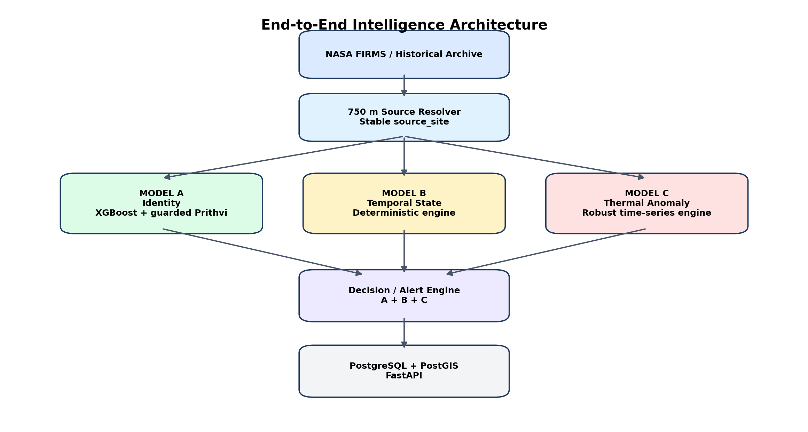

# Document Control

| **Field**                       | **Value**                                                                                                                                                                    |
|---------------------------------|------------------------------------------------------------------------------------------------------------------------------------------------------------------------------|
| Project                         | SIH26162 - Industrial Thermal Intelligence and Early-Warning Platform                                                                                                        |
| Purpose                         | Single source of truth for completed research, frozen model logic, files, deployment requirements, backend/API/database design, live FIRMS ingestion and web implementation. |
| Version                         | 1.1 (Validated)                                                                                                                                                              |
| Date                            | 04 September 2026                                                                                                                                                            |
| Model status                    | Source resolver frozen; Model A logic frozen; Model B frozen; Model C V3 logic frozen. Runtime artifact packaging/checksums remain a deployment gate.                        |
| Implementation status           | Decision engine, live FIRMS backfill/polling, unified backend, PostGIS, API and OSIRIS-style web command center remain to be implemented.                                    |
| Authoritative runtime principle | Frontend never runs model logic or contacts FIRMS/Earthdata directly. All intelligence is produced in the backend and served through normalized APIs.                        |

| **Critical deployment note** The current historical timeline ends on 2025-12-31. Before any 2026 live demonstration, backfill NOAA-20 FIRMS detections from 2026-01-01 through the current date, update source assignments, and recompute Models B and C as-of the new latest observation date. Otherwise temporal states and anomaly baselines will be stale. |
|----------------------------------------------------------------------------------------------------------------------------------------------------------------------------------------------------------------------------------------------------------------------------------------------------------------------------------------------------------------|

# 1. Executive Summary

The project has moved from an exploratory FIRMS hotspot classifier into a structured source-centric thermal-intelligence system. The fundamental unit is not an individual satellite hotspot. It is a persistent physical source_site produced by a frozen 750 m spatial resolver. Every site is interpreted through three independent components: Model A identifies the likely source class, Model B describes its temporal operating state, and Model C determines whether its current thermal behavior is abnormal relative to its own history.

*Figure 1. Frozen intelligence architecture. The decision/alert engine and web platform are the next implementation layer.*

## 1.1 Frozen intelligence stack

| **Component**   | **Question answered**                                      | **Technical type**                                                       | **Frozen production output**                                         |
|-----------------|------------------------------------------------------------|--------------------------------------------------------------------------|----------------------------------------------------------------------|
| Source Resolver | Which FIRMS detections belong to the same physical source? | DBSCAN-derived 750 m site definition; incremental resolver for live mode | source_site / site_id                                                |
| Model A         | What is this source?                                       | Supervised XGBoost A-Core + optional guarded Prithvi visual rescue       | INDUSTRIAL / NONINDUSTRIAL / UNKNOWN + provenance                    |
| Model B         | How is this source behaving over time?                     | Deterministic temporal-state engine                                      | NEW / INTERMITTENT / PERSISTENT / DORMANT / REACTIVATED + confidence |
| Model C         | Is the current site-day abnormal for this site?            | Unsupervised site-specific time-series anomaly engine                    | NORMAL / ELEVATED / ANOMALOUS / CRITICAL / INSUFFICIENT_HISTORY      |
| Decision Engine | What operational alert should be shown?                    | Deterministic A+B+C fusion rules - not yet frozen                        | Alert severity, alert type, reason, evidence                         |
| Web Platform    | How is intelligence consumed?                              | FastAPI + PostGIS + Next.js/React + MapLibre/deck.gl                     | Live map, timeline, evidence, alerts, replay                         |

## 1.2 Immediate next objective

Do not train additional models before implementation. The next milestone is to package the frozen algorithms into a unified backend, backfill 2026 FIRMS history, implement the deterministic alert layer, materialize a current source-status snapshot in PostGIS, expose normalized APIs, and then build the OSIRIS-style geospatial command center.

# 2. Problem Definition and Product Goal

Industrial facilities such as refineries, petrochemical complexes, power plants, steel and cement facilities, mines, LNG terminals and flaring infrastructure can produce thermal signatures detectable from space. NASA FIRMS provides active-fire / thermal-anomaly detections, but a raw thermal point is not equivalent to an industrial fire, and FIRMS by itself does not provide the source identity, temporal operating state, or whether the activity is abnormal for that specific site.

## 2.1 Product objective

- Transform raw satellite thermal detections into stable physical source sites.

- Classify source identity without treating FIRMS type codes, OSM proximity or persistence as ground truth.

- Describe whether the source is new, intermittent, persistent, dormant or reactivated.

- Detect site-specific thermal escalation relative to the source's historical baseline.

- Combine the three outputs into actionable alerts while preserving UNKNOWN and INSUFFICIENT_HISTORY states.

- Provide evidence-first analyst tooling: live map, timeline, imagery, industrial facility context, raw FIRMS detections and model provenance.

## 2.2 Core product statement

| **Product positioning** FIRMS supplies the thermal trigger. The 750 m resolver creates stable sites. Model A determines source identity. Model B characterizes temporal state. Model C measures abnormality. GIS and imagery provide supporting evidence. The web application turns these outputs into a live thermal-intelligence and early-warning system. |
|--------------------------------------------------------------------------------------------------------------------------------------------------------------------------------------------------------------------------------------------------------------------------------------------------------------------------------------------------------------|

# 3. Current Project Status - Completed vs To Implement

| **Workstream**                             | **Status**                     | **Notes**                                                                             |
|--------------------------------------------|--------------------------------|---------------------------------------------------------------------------------------|
| Historical NOAA-20 FIRMS archive ingestion | FROZEN                         | 2025 source history processed; observation window 2025-01-01 to 2025-12-31.           |
| 750 m source resolver                      | FROZEN                         | 79,365 India source sites; eps 750 m, min_samples 3.                                  |
| Ground-truth framework                     | FROZEN                         | Affirmative positive/negative evidence; UNKNOWN preserved; conflict review preserved. |
| Model A-Core                               | FROZEN                         | XGBoost T+R+S+L; LOW .405 / CORE .885 / STRONG .975.                                  |
| Prithvi A-Image                            | FROZEN AS GUARDED PILOT BRANCH | Prithvi can rescue uncertain A-Core only; threshold .965; cannot veto CORE/STRONG.    |
| Model B                                    | FROZEN                         | Five deterministic states + confidence.                                               |
| Model C V3                                 | FROZEN                         | Robust site baseline + 4 anomaly groups + calibrated top-two evidence score.          |
| Isolation Forest                           | ABLATION ONLY                  | Secondary audit/comparator; not allowed to override Model C V3.                       |
| A+B+C decision engine                      | TO IMPLEMENT                   | Create deterministic alert type/severity rules and regression tests.                  |
| 2026 FIRMS backfill                        | MANDATORY TO IMPLEMENT         | Backfill 2026-01-01 to current date before live deployment.                           |
| Live FIRMS polling                         | TO IMPLEMENT                   | Backend service using NASA FIRMS Area API and secure MAP_KEY.                         |
| Incremental source resolver                | TO IMPLEMENT                   | Assign new detections to frozen sites; manage candidate new sites.                    |
| PostgreSQL/PostGIS                         | TO IMPLEMENT                   | Persist detections, sites, model status, history, evidence and alerts.                |
| FastAPI backend                            | TO IMPLEMENT                   | Normalized site/alert/timeline/evidence endpoints.                                    |
| OSIRIS-style frontend                      | TO IMPLEMENT                   | MapLibre/deck.gl command center, live and replay modes.                               |

# 4. Frozen Design Principles

| **Principle**                          | **Implementation consequence**                                                                                                         |
|----------------------------------------|----------------------------------------------------------------------------------------------------------------------------------------|
| Site-centric, not hotspot-centric      | A single FIRMS detection is evidence, not a physical source. Identity and temporal reasoning operate at source_site level.             |
| 750 m is frozen                        | 1000 m created only a small weak-label F1 gain but severe spatial chaining and multi-source merges. 750 m preserves micro-sites.       |
| No FIRMS type shortcut                 | Type 2 means other static land source, not industrial truth. Type 3 means offshore/water, not automatically rig or flare.              |
| No OSM negative veto                   | Positive context may support review/evidence; absence of an OSM feature can never force NONINDUSTRIAL.                                 |
| No circular evaluation                 | Data used to construct labels cannot be presented as independent validation when the same context is used as a feature or fusion rule. |
| Model A remains usable without imagery | Prithvi is optional. A-Core is the primary deployable classifier.                                                                      |
| Prithvi may rescue, never veto         | High-confidence A-Core industrial decisions stay industrial even when Prithvi strongly disagrees.                                      |
| Model B is a state engine, not fake ML | Do not train XGBoost to reproduce labels generated from the same temporal rules.                                                       |
| Model C is site-relative               | No global rule such as FRP \> X = fire. Anomaly is deviation from the site's prior behavior.                                           |
| Chronology is sacred                   | Model C scores an event using only earlier observations. Future values must never leak into its baseline.                              |
| Unknown is a real output               | UNKNOWN, CONFLICT_REVIEW and INSUFFICIENT_HISTORY are not errors to be coerced into a confident class.                                 |
| Frontend is presentation only          | FIRMS credentials, feature engineering, inference and decision logic remain server-side.                                               |
