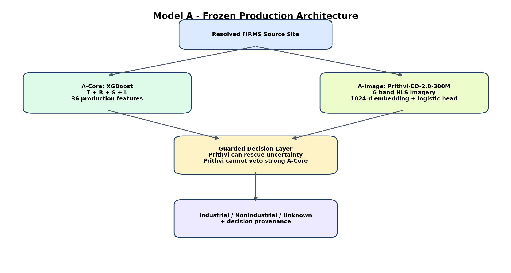
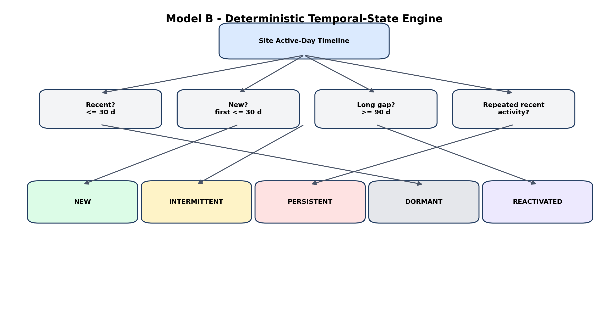
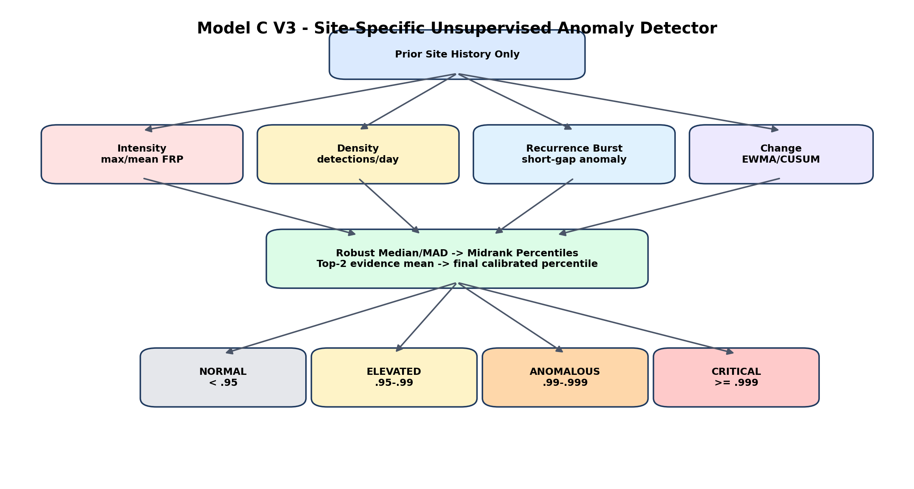
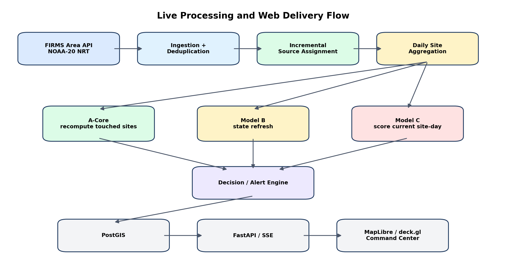

> Fidelity copy converted from the validated DOCX. If a split document appears ambiguous, use this file as the tie-breaker.

**SIH26162**

**AI-Based Detection and Classification of Industrial Fires  
and Persistent Thermal Sources**

Complete Technical, Model, Data, Backend and Web Implementation Documentation

**Version 1.1 (Validated) \| 04 September 2026**

Status: Model logic A, B and C frozen for web implementation; runtime artifact presence/checksums must be verified during packaging; unified decision engine and live platform are the next implementation phase.

# Document Control

| **Field**                       | **Value**                                                                                                                                                                    |
|---------------------------------|------------------------------------------------------------------------------------------------------------------------------------------------------------------------------|
| Project                         | SIH26162 - Industrial Thermal Intelligence and Early-Warning Platform                                                                                                        |
| Purpose                         | Single source of truth for completed research, frozen model logic, files, deployment requirements, backend/API/database design, live FIRMS ingestion and web implementation. |
| Version                         | 1.1 (Validated)                                                                                                                                                              |
| Date                            | 04 September 2026                                                                                                                                                            |
| Model status                    | Source resolver frozen; Model A logic frozen; Model B frozen; Model C V3 logic frozen. Runtime artifact packaging/checksums remain a deployment gate.                        |
| Implementation status           | Decision engine, live FIRMS backfill/polling, unified backend, PostGIS, API and OSIRIS-style web command center remain to be implemented.                                    |
| Authoritative runtime principle | Frontend never runs model logic or contacts FIRMS/Earthdata directly. All intelligence is produced in the backend and served through normalized APIs.                        |

| **Critical deployment note** The current historical timeline ends on 2025-12-31. Before any 2026 live demonstration, backfill NOAA-20 FIRMS detections from 2026-01-01 through the current date, update source assignments, and recompute Models B and C as-of the new latest observation date. Otherwise temporal states and anomaly baselines will be stale. |
|----------------------------------------------------------------------------------------------------------------------------------------------------------------------------------------------------------------------------------------------------------------------------------------------------------------------------------------------------------------|

# Contents

- 1\. Executive Summary

- 2\. Problem Definition and Product Goal

- 3\. Current Project Status - Completed vs To Implement

- 4\. Frozen Design Principles

- 5\. Data Foundation and 750 m Source Resolver

- 6\. Ground Truth and Training Data Construction

- 7\. Model A - Source Identity

- 8\. Model B - Temporal State

- 9\. Model C - Thermal Anomaly

- 10\. Validation, Audits and What Can Be Claimed

- 11\. Unified Decision / Alert Engine - To Implement

- 12\. Live NASA FIRMS Integration and 2026 Backfill

- 13\. HLS / Prithvi Operational Integration

- 14\. External GIS and Facility Evidence Layers

- 15\. Runtime Packaging - How A, B and C Deploy Together

- 16\. Backend Architecture and Repository Structure

- 17\. PostgreSQL / PostGIS Data Model

- 18\. FastAPI Contract

- 19\. OSIRIS-Style Web Command Center

- 20\. End-to-End Live Processing Flow

- 21\. Historical Replay Mode

- 22\. Deployment, Scheduling and Performance

- 23\. Security, Secrets, Licensing and Provenance

- 24\. Testing and Acceptance Criteria

- 25\. Exact Implementation Roadmap

- 26\. Risks, Limitations and Future Work

- Appendix A. Exact Model A Feature Set

- Appendix B. Frozen Thresholds and Rules

- Appendix C. Current File / Artifact Inventory

- Appendix D. Runtime Environment Variables

- Appendix E. Example Unified JSON Contract

- Appendix F. Do-Not-Change / Do-Not-Do Checklist

- Appendix G. External References

# 1. Executive Summary

The project has moved from an exploratory FIRMS hotspot classifier into a structured source-centric thermal-intelligence system. The fundamental unit is not an individual satellite hotspot. It is a persistent physical source_site produced by a frozen 750 m spatial resolver. Every site is interpreted through three independent components: Model A identifies the likely source class, Model B describes its temporal operating state, and Model C determines whether its current thermal behavior is abnormal relative to its own history.

*Figure 1. Frozen intelligence architecture. The decision/alert engine and web platform are the next implementation layer.*

## 1.1 Frozen intelligence stack

| **Component**   | **Question answered**                                      | **Technical type**                                                       | **Frozen production output**                                         |
|-----------------|------------------------------------------------------------|--------------------------------------------------------------------------|----------------------------------------------------------------------|
| Source Resolver | Which FIRMS detections belong to the same physical source? | DBSCAN-derived 750 m site definition; incremental resolver for live mode | source_site / site_id                                                |
| Model A         | What is this source?                                       | Supervised XGBoost A-Core + optional guarded Prithvi visual rescue       | INDUSTRIAL / NONINDUSTRIAL / UNKNOWN + provenance                    |
| Model B         | How is this source behaving over time?                     | Deterministic temporal-state engine                                      | NEW / INTERMITTENT / PERSISTENT / DORMANT / REACTIVATED + confidence |
| Model C         | Is the current site-day abnormal for this site?            | Unsupervised site-specific time-series anomaly engine                    | NORMAL / ELEVATED / ANOMALOUS / CRITICAL / INSUFFICIENT_HISTORY      |
| Decision Engine | What operational alert should be shown?                    | Deterministic A+B+C fusion rules - not yet frozen                        | Alert severity, alert type, reason, evidence                         |
| Web Platform    | How is intelligence consumed?                              | FastAPI + PostGIS + Next.js/React + MapLibre/deck.gl                     | Live map, timeline, evidence, alerts, replay                         |

## 1.2 Immediate next objective

Do not train additional models before implementation. The next milestone is to package the frozen algorithms into a unified backend, backfill 2026 FIRMS history, implement the deterministic alert layer, materialize a current source-status snapshot in PostGIS, expose normalized APIs, and then build the OSIRIS-style geospatial command center.

# 2. Problem Definition and Product Goal

Industrial facilities such as refineries, petrochemical complexes, power plants, steel and cement facilities, mines, LNG terminals and flaring infrastructure can produce thermal signatures detectable from space. NASA FIRMS provides active-fire / thermal-anomaly detections, but a raw thermal point is not equivalent to an industrial fire, and FIRMS by itself does not provide the source identity, temporal operating state, or whether the activity is abnormal for that specific site.

## 2.1 Product objective

- Transform raw satellite thermal detections into stable physical source sites.

- Classify source identity without treating FIRMS type codes, OSM proximity or persistence as ground truth.

- Describe whether the source is new, intermittent, persistent, dormant or reactivated.

- Detect site-specific thermal escalation relative to the source's historical baseline.

- Combine the three outputs into actionable alerts while preserving UNKNOWN and INSUFFICIENT_HISTORY states.

- Provide evidence-first analyst tooling: live map, timeline, imagery, industrial facility context, raw FIRMS detections and model provenance.

## 2.2 Core product statement

| **Product positioning** FIRMS supplies the thermal trigger. The 750 m resolver creates stable sites. Model A determines source identity. Model B characterizes temporal state. Model C measures abnormality. GIS and imagery provide supporting evidence. The web application turns these outputs into a live thermal-intelligence and early-warning system. |
|--------------------------------------------------------------------------------------------------------------------------------------------------------------------------------------------------------------------------------------------------------------------------------------------------------------------------------------------------------------|

# 3. Current Project Status - Completed vs To Implement

| **Workstream**                             | **Status**                     | **Notes**                                                                             |
|--------------------------------------------|--------------------------------|---------------------------------------------------------------------------------------|
| Historical NOAA-20 FIRMS archive ingestion | FROZEN                         | 2025 source history processed; observation window 2025-01-01 to 2025-12-31.           |
| 750 m source resolver                      | FROZEN                         | 79,365 India source sites; eps 750 m, min_samples 3.                                  |
| Ground-truth framework                     | FROZEN                         | Affirmative positive/negative evidence; UNKNOWN preserved; conflict review preserved. |
| Model A-Core                               | FROZEN                         | XGBoost T+R+S+L; LOW .405 / CORE .885 / STRONG .975.                                  |
| Prithvi A-Image                            | FROZEN AS GUARDED PILOT BRANCH | Prithvi can rescue uncertain A-Core only; threshold .965; cannot veto CORE/STRONG.    |
| Model B                                    | FROZEN                         | Five deterministic states + confidence.                                               |
| Model C V3                                 | FROZEN                         | Robust site baseline + 4 anomaly groups + calibrated top-two evidence score.          |
| Isolation Forest                           | ABLATION ONLY                  | Secondary audit/comparator; not allowed to override Model C V3.                       |
| A+B+C decision engine                      | TO IMPLEMENT                   | Create deterministic alert type/severity rules and regression tests.                  |
| 2026 FIRMS backfill                        | MANDATORY TO IMPLEMENT         | Backfill 2026-01-01 to current date before live deployment.                           |
| Live FIRMS polling                         | TO IMPLEMENT                   | Backend service using NASA FIRMS Area API and secure MAP_KEY.                         |
| Incremental source resolver                | TO IMPLEMENT                   | Assign new detections to frozen sites; manage candidate new sites.                    |
| PostgreSQL/PostGIS                         | TO IMPLEMENT                   | Persist detections, sites, model status, history, evidence and alerts.                |
| FastAPI backend                            | TO IMPLEMENT                   | Normalized site/alert/timeline/evidence endpoints.                                    |
| OSIRIS-style frontend                      | TO IMPLEMENT                   | MapLibre/deck.gl command center, live and replay modes.                               |

# 4. Frozen Design Principles

| **Principle**                          | **Implementation consequence**                                                                                                         |
|----------------------------------------|----------------------------------------------------------------------------------------------------------------------------------------|
| Site-centric, not hotspot-centric      | A single FIRMS detection is evidence, not a physical source. Identity and temporal reasoning operate at source_site level.             |
| 750 m is frozen                        | 1000 m created only a small weak-label F1 gain but severe spatial chaining and multi-source merges. 750 m preserves micro-sites.       |
| No FIRMS type shortcut                 | Type 2 means other static land source, not industrial truth. Type 3 means offshore/water, not automatically rig or flare.              |
| No OSM negative veto                   | Positive context may support review/evidence; absence of an OSM feature can never force NONINDUSTRIAL.                                 |
| No circular evaluation                 | Data used to construct labels cannot be presented as independent validation when the same context is used as a feature or fusion rule. |
| Model A remains usable without imagery | Prithvi is optional. A-Core is the primary deployable classifier.                                                                      |
| Prithvi may rescue, never veto         | High-confidence A-Core industrial decisions stay industrial even when Prithvi strongly disagrees.                                      |
| Model B is a state engine, not fake ML | Do not train XGBoost to reproduce labels generated from the same temporal rules.                                                       |
| Model C is site-relative               | No global rule such as FRP \> X = fire. Anomaly is deviation from the site's prior behavior.                                           |
| Chronology is sacred                   | Model C scores an event using only earlier observations. Future values must never leak into its baseline.                              |
| Unknown is a real output               | UNKNOWN, CONFLICT_REVIEW and INSUFFICIENT_HISTORY are not errors to be coerced into a confident class.                                 |
| Frontend is presentation only          | FIRMS credentials, feature engineering, inference and decision logic remain server-side.                                               |

# 5. Data Foundation and 750 m Source Resolver

## 5.1 Historical FIRMS source

The frozen source catalogue was built from the NOAA-20 VIIRS archive file /content/drive/MyDrive/SIH26162/data/DL_FIRE_J1V-C2_794660.zip. The India working extent used during processing was approximately latitude 6-38 degrees and longitude 67-98 degrees. The historical time window used by Model B/C is 2025-01-01 through 2025-12-31.

## 5.2 Source clustering

> DBSCAN(metric='haversine', eps=750 / EarthRadius, min_samples=3)  
> unit = resolved source_site, not hotspot row

The 750 m value is a neighborhood link radius, not a maximum cluster diameter. DBSCAN can chain nearby detections, which is why the larger 1000 m candidate was rejected despite a very small weak-label score increase.

## 5.3 750 m vs 1000 m audit

| **Metric**                | **750 m**        | **1000 m**              | **Interpretation**                                 |
|---------------------------|------------------|-------------------------|----------------------------------------------------|
| Common-site weak-label F1 | 0.7257           | 0.7335                  | Only +0.78 percentage point for 1000 m.            |
| Multi-child merges        | Lower / baseline | 3,888                   | 1000 m merges many 750 m micro-sites.              |
| P90 child separation      | \-               | 6.014 km                | Far larger than an intended industrial micro-site. |
| Maximum child separation  | \-               | 54.573 km               | Clear chaining failure.                            |
| Extreme example           | \-               | 47-child merged cluster | Physically unacceptable source identity.           |

| **Frozen decision** 750 m / min_samples=3 is the physical source baseline. Do not rerun a 1000 m resolver in the web implementation. |
|--------------------------------------------------------------------------------------------------------------------------------------|

## 5.4 Live source resolution must be incremental

Do not rerun full-year DBSCAN every time new FIRMS data arrives. Store frozen sites and historical detection geometry in PostGIS. For each new point, search for existing site membership within 750 m of historical site detections. If multiple frozen sites qualify, assign to the nearest site and record an AMBIGUOUS_ASSIGNMENT audit flag rather than merging frozen sites.

- No match: write the point to candidate_sources.

- Candidate detections accumulate spatially using the same 750 m neighborhood logic.

- Promote a candidate to a permanent source only after at least 3 spatially consistent detections, matching the training-time min_samples requirement.

- On promotion, allocate a new stable site_id and compute static land-cover features once.

Streaming-equivalence requirement: the incremental resolver is a deployment approximation to frozen batch DBSCAN graph membership. Before activation, replay historical detections in time order and verify that assignments reproduce frozen site_ids at a high rate. If a new detection is within 750 m of more than one frozen site, preserve both candidates in the audit record and do not merge frozen sites automatically.

# 6. Ground Truth and Training Data Construction

## 6.1 Ground-truth philosophy

The project explicitly rejected the shortcut “far from known industry = nonindustrial.” Industrial labels require affirmative facility/reference/human evidence. Nonindustrial labels require affirmative wildfire, forest-fire, crop-burning, natural or manual evidence. Sites without adequate evidence remain UNKNOWN. Conflicting evidence remains CONFLICT_REVIEW.

## 6.2 Evidence metadata

> gt_source, gt_authority, gt_country, gt_geographic_scope, gt_class,  
> source_independence, coordinate_quality, label_confidence

## 6.3 Final source master

| **Label status** | **Count** | **Notes**                                                      |
|------------------|-----------|----------------------------------------------------------------|
| INDUSTRIAL       | 808       | Final supervised positive sites.                               |
| NONINDUSTRIAL    | 22,902    | Affirmative negative evidence.                                 |
| UNKNOWN          | 55,552    | No adequate affirmative truth; preserved.                      |
| CONFLICT_REVIEW  | 103       | Evidence conflict; excluded from ordinary supervised training. |
| TOTAL            | 79,365    | All frozen source sites.                                       |

Within the full source master, evidence tiers include 251 GOLD and 660 SILVER_A records; these totals also include the 103 conflict-review records. The final supervised industrial subset consists of 205 GOLD + 603 SILVER_A = 808 positives.

## 6.4 Silver-A review history

- 83 reviewed candidates: 66 INDUSTRIAL, 12 UNCERTAIN, 5 NONINDUSTRIAL.

- Generic INSIDE_OSM_INDUSTRIAL was judged too weak and moved out of Silver-A.

- The revised acceptance logic retained 63 reviewed candidates: 55 INDUSTRIAL, 8 UNCERTAIN, 0 NONINDUSTRIAL among the accepted subset.

- OSM-specific failures were concentrated in weak quarry/resource-coal contexts; these are not treated as standalone strong truth without corroboration.

## 6.5 Key training files

| **Path**                                                                                  | **Purpose**                                                   |
|-------------------------------------------------------------------------------------------|---------------------------------------------------------------|
| /content/drive/MyDrive/SIH26162/model_a_final/built/source_sites_ground_truth_FINAL.csv   | All source sites with final truth status / evidence metadata. |
| /content/drive/MyDrive/SIH26162/model_a_final/built/model_a_supervised_with_folds.csv     | Final supervised dataset with frozen geographic folds.        |
| /content/drive/MyDrive/SIH26162/model_a_final/built/model_a_development_FULL_ENV.csv      | Full enriched development pool.                               |
| /content/drive/MyDrive/SIH26162/model_a_final/built/model_a_internal_holdout_FULL_ENV.csv | Frozen natural-distribution holdout.                          |
| /content/drive/MyDrive/SIH26162/model_a_final/built/model_a_internal_holdout.csv          | Pre-enrichment holdout / audit snapshot.                      |

# 7. Model A - Source Identity

## 7.1 Deployment definition

| **Frozen definition** Model A = A-Core (XGBoost T+R+S+L) + optional A-Image (Prithvi-EO-2.0-300M) under a guarded rescue policy. GIS/OSM/GEM are evidence layers, not required AI prediction inputs. |
|------------------------------------------------------------------------------------------------------------------------------------------------------------------------------------------------------|

## 7.2 A-Core algorithm

The core is a serialized scikit-learn Pipeline containing median imputation and XGBoost binary classification. Deployment must load the serialized pipeline rather than manually recreating training hyperparameters. The documented training family used 300 estimators, depth 3, learning rate .035, min_child_weight 2, subsample .85, colsample_bytree .85, reg_alpha .05, reg_lambda 2, binary:logistic objective, logloss evaluation, class weighting from NEG/POS, random_state 42 and hist tree method.

## 7.3 Production feature families

| **Family**             | **Meaning**                       | **Count** | **Production status** |
|------------------------|-----------------------------------|-----------|-----------------------|
| T                      | Thermal intensity/statistics      | 13        | INCLUDED              |
| R                      | Recurrence / persistence behavior | 11        | INCLUDED              |
| S                      | Spatial dispersion                | 3         | INCLUDED              |
| L                      | WorldCover land-cover fractions   | 9         | INCLUDED              |
| N                      | Nighttime lights                  | 5         | EXCLUDED              |
| OSM distances          | Industrial/power/works proximity  | \-        | EXCLUDED from A-Core  |
| FIRMS type/static clue | Type fractions / persistence_seed | \-        | EXCLUDED              |

Total production feature count: 36. The exact list is provided in Appendix A. Model A feature semantics must match training exactly. In particular, Model A active_days_7/30/90/365 features were computed relative to the source's own last detection; do not substitute Model B's observation-end semantics.

## 7.4 Why NTL was dropped

Nighttime light features produced no reliable holdout ROC gain and increased false positives in high-built / high-NTL negatives. The selected production architecture is M2_NO_NTL = T+R+S+L.

## 7.5 Geographic split and final holdout

Sites were grouped into 0.5-degree geographic blocks. A five-fold StratifiedGroupKFold split with random_state=42 was used. Fold 0 was frozen as the internal natural-distribution holdout before performance inspection. Development uses folds 1-4.

| **Dataset**    | **Sites** | **Industrial** | **Nonindustrial** |
|----------------|-----------|----------------|-------------------|
| Development    | 19,038    | 639            | 18,399            |
| Frozen holdout | 4,672     | 169            | 4,503             |

## 7.6 Production A-Core thresholds

| **Band** | **Threshold** | **Operational meaning**                                                    | **Holdout precision** | **Holdout recall** | **Specificity** |
|----------|---------------|----------------------------------------------------------------------------|-----------------------|--------------------|-----------------|
| LOW      | 0.405         | Below this: NONINDUSTRIAL; above this uncertain/positive processing begins | 0.4894                | 0.9527             | 0.9627          |
| CORE     | 0.885         | Core industrial decision                                                   | 0.8199                | 0.7811             | 0.9936          |
| STRONG   | 0.975         | Very high confidence industrial decision                                   | 0.9020                | 0.5444             | 0.9978          |

## 7.7 Ablation result that justifies the architecture

| **Comparison**           | **Holdout ROC delta** | **Interpretation**                                                                                       |
|--------------------------|-----------------------|----------------------------------------------------------------------------------------------------------|
| FULL vs persistence-only | +0.1076               | Persistence alone is decisively insufficient.                                                            |
| FULL vs no-persistence   | +0.0014               | Thermal/spatial/land-cover already carry most discrimination; recurrence adds small complementary value. |
| FULL vs no-NTL           | -0.0003               | NTL provides no reliable benefit and worsens urban shortcut behavior.                                    |

## 7.8 Prithvi visual branch

The image branch uses the official ibm-nasa-geospatial/Prithvi-EO-2.0-300M foundation model as a frozen encoder, with a lightweight logistic-regression classifier on the resulting 1024-dimensional embedding. The pilot intentionally uses a single cloud-screened HLS scene repeated across four model frames to test spatial morphology only; it is not yet a true four-date temporal Prithvi implementation.

| **Item**                              | **Frozen pilot value**                                                               |
|---------------------------------------|--------------------------------------------------------------------------------------|
| Pilot total                           | 270 sites                                                                            |
| Usable imagery                        | 233 sites                                                                            |
| Usable DEV / HOLDOUT                  | 155 / 78                                                                             |
| Embedding dimension                   | 1024                                                                                 |
| Image size                            | 224 x 224                                                                            |
| Channels                              | 6 HLS spectral channels                                                              |
| Prithvi strong rescue threshold       | 0.965                                                                                |
| DEV OOF precision at rescue threshold | 0.9524                                                                               |
| Guarded holdout rescue                | 1 site; it was industrial                                                            |
| Policy                                | Prithvi can rescue A-Core uncertainty only; it cannot veto CORE or STRONG decisions. |

## 7.9 Learned fusion was tested and rejected for decision use

A learned logistic fusion of A-Core probability and Prithvi probability improved ranking metrics on the small usable holdout (ROC about 0.966 and PR-AUC about 0.927) but produced worse thresholded F1 because Prithvi was sometimes confidently wrong on sites where A-Core was confidently correct. The production solution therefore preserves A-Core authority and uses Prithvi only in the uncertainty band.

## 7.10 Frozen guarded decision logic

> if a_core \>= 0.975: INDUSTRIAL_CORE_STRONG  
> elif a_core \>= 0.885: INDUSTRIAL_CORE_POSITIVE  
> elif a_core \>= 0.405:  
> if HLS available and prithvi \>= 0.965: INDUSTRIAL_PRITHVI_RESCUE  
> else: UNKNOWN  
> else: NONINDUSTRIAL

## 7.11 Required Model A artifacts

| **Artifact**                                                                      | **Runtime role**                                                                                                       |
|-----------------------------------------------------------------------------------|------------------------------------------------------------------------------------------------------------------------|
| /content/drive/MyDrive/SIH26162/model_a_final/models/MODEL_A_FINAL.joblib         | Authoritative A-Core serialized pipeline.                                                                              |
| /content/drive/MyDrive/SIH26162/model_a_final/models/MODEL_A_PRITHVI_FINAL.joblib | Frozen target artifact for guarded image-branch head/config. Verify presence and checksum before repository packaging. |
| /content/drive/MyDrive/SIH26162/model_a_final/audit/model_a_final_config.json     | A-Core feature/threshold/config audit.                                                                                 |
| /content/drive/MyDrive/SIH26162/model_a_prithvi/results/prithvi_final_config.json | Frozen rescue-policy target config. Verify presence and checksum before repository packaging.                          |
| Prithvi_EO_V2_300M.pt + config.json + prithvi_mae.py                              | Official foundation-model weights/config/code. Pin a known repository revision for reproducible deployment.            |

# 8. Model B - Temporal State

## 8.1 Technical type

Model B is intentionally not a conventional fitted ML estimator. It is a deterministic temporal-state classification engine. The value is in explicit, auditable operational definitions rather than training a second classifier to imitate labels generated by our own rules.

## 8.2 Input

- Per-site active-day timeline derived from resolved FIRMS detections.

- first_seen, last_seen, active-day counts, lifetime, recent active months, recurrence gaps and reactivation timing.

- A dynamic as_of_date equal to the latest ingested observation date for batch processing, or the current operational date in live mode.

## 8.3 Frozen state logic

| **State**    | **Rule / meaning**                                                                                                             |
|--------------|--------------------------------------------------------------------------------------------------------------------------------|
| REACTIVATED  | Recently active (\<=30 d), historical source, last long inactive gap \>=90 d, reactivation began \<=30 d ago. Evaluated first. |
| NEW          | Recently active and first observed \<=30 d ago.                                                                                |
| PERSISTENT   | Recently active, lifetime \>=90 d, active in \>=3 months of the last 180 d, and \>=6 active days in the last 180 d.            |
| DORMANT      | No detection for \>90 d.                                                                                                       |
| INTERMITTENT | Everything not satisfying the higher-priority states.                                                                          |

## 8.4 Frozen precedence

> REACTIVATED -\> NEW -\> PERSISTENT -\> DORMANT -\> INTERMITTENT

This precedence ensures an old site that has just returned after a long gap is marked REACTIVATED rather than immediately PERSISTENT.

## 8.5 Confidence logic

| **State**    | **LOW**             | **MEDIUM**                          | **HIGH**                                           |
|--------------|---------------------|-------------------------------------|----------------------------------------------------|
| NEW          | active_days_30 == 1 | typically 2 recent active days      | active_days_30 \>= 3                               |
| REACTIVATED  | active_days_30 == 1 | \>=2 recent active days unless HIGH | \>=3 recent active days and last long gap \>=180 d |
| PERSISTENT   | \-                  | default                             | active_months_180 \>=4 and active_days_180 \>=12   |
| DORMANT      | \-                  | 91-179 d since last detection       | \>=180 d since last detection                      |
| INTERMITTENT | \-                  | all cases                           | \-                                                 |

## 8.6 Frozen 2025 state distribution

| **State**    | **Sites** | **Fraction** |
|--------------|-----------|--------------|
| DORMANT      | 61,890    | 77.98%       |
| INTERMITTENT | 10,399    | 13.10%       |
| REACTIVATED  | 5,047     | 6.36%        |
| NEW          | 1,551     | 1.95%        |
| PERSISTENT   | 478       | 0.60%        |
| TOTAL        | 79,365    | 100%         |

Confidence totals: HIGH 62,753; MEDIUM 13,231; LOW 3,381.

## 8.7 Independence from Model A

Known industrial sites occur in every state: DORMANT 267, INTERMITTENT 332, NEW 26, PERSISTENT 129 and REACTIVATED 54. Therefore Model B is not functioning as another industrial classifier. Persistence is associated with industrial activity but is neither necessary nor sufficient for industrial identity.

## 8.8 Deployment artifacts

| **Artifact**                                                                  | **Runtime role**                                                                                 |
|-------------------------------------------------------------------------------|--------------------------------------------------------------------------------------------------|
| /content/drive/MyDrive/SIH26162/model_b/built/MODEL_B_SOURCE_STATES_FINAL.csv | Frozen 2025 site-state snapshot; useful for bootstrap and regression, not a live model.          |
| /content/drive/MyDrive/SIH26162/model_b/built/site_daily_activity.parquet     | Per-site daily thermal history; essential bootstrap state for Model B and C.                     |
| /content/drive/MyDrive/SIH26162/model_b/audit/MODEL_B_FINAL.json              | Frozen state thresholds and audit counts.                                                        |
| backend/engines/model_b.py                                                    | TO IMPLEMENT. Executable state engine.                                                           |
| backend/config/model_b.json                                                   | TO IMPLEMENT. recent_days=30, dormant_days=90, reactivation_gap_days=90 and confidence settings. |

# 9. Model C - Thermal Anomaly

## 9.1 Technical type

Model C V3 is an unsupervised, site-specific statistical time-series anomaly detector. It learns a baseline from each site's earlier active days and measures whether the current active-day behavior is unusual. Isolation Forest is retained only as a classical unsupervised-ML ablation and secondary audit.

## 9.2 Cold-start requirements

| **Parameter**      | **Frozen value** | **Meaning**                                                                    |
|--------------------|------------------|--------------------------------------------------------------------------------|
| MIN_ACTIVE_HISTORY | 5                | At least five prior active days before scoring current day.                    |
| MIN_SPAN_DAYS      | 30               | Prior history must span at least 30 days.                                      |
| MIN_GAP_HISTORY    | 3                | At least three historical recurrence gaps before recurrence-burst score.       |
| EWMA_ALPHA         | 0.35             | Weight of current change signal.                                               |
| CUSUM_K            | 2.0              | CUSUM reference / drift allowance.                                             |
| CUSUM_CAP          | 50               | Bound cumulative change.                                                       |
| CHANGE_RESET_GAP   | 30 days          | Reset EWMA/CUSUM after long inactivity so C does not duplicate B reactivation. |
| Z_CAP              | 20               | Cap robust component z-scores.                                                 |

## 9.3 Robust baseline

> location = median(history)  
> scale = 1.4826 \* median(\|x - median\|)  
> if scale ~ 0: scale = IQR / 1.349  
> scale floor = max(scale, 0.05 \* \|median\|, 1e-3)

## 9.4 Four frozen anomaly groups

| **Group**        | **Raw signal**                                                   | **Direction**                                                                          |
|------------------|------------------------------------------------------------------|----------------------------------------------------------------------------------------|
| Intensity        | max(z_max_frp, z_mean_frp)                                       | Only positive thermal escalation matters.                                              |
| Density          | z of log1p(detections/day)                                       | Unexpectedly many detections in the active day.                                        |
| Recurrence burst | max(0, (historical_median_gap - current_gap) / robust_gap_scale) | Only unexpectedly SHORT return gaps are anomalous; long inactivity belongs to Model B. |
| Change           | max(EWMA score, bounded CUSUM score)                             | Sustained escalation; reset after \>30 d gap.                                          |

## 9.5 Chronological replay

For each site-day at time t, the baseline is calculated only from active days strictly before t. The current day is then scored. In live mode, multiple new FIRMS detections on the same date update the current day aggregate in place; the baseline continues to exclude the current day until the day is complete and becomes historical on the next date.

## 9.6 V3 calibration and score

1.  Convert each anomaly group to an empirical midrank percentile using the earlier calibration replay.

2.  Take the two strongest available group percentiles and average them. This requires corroboration and prevents one isolated axis from creating CRITICAL.

3.  Calibrate that top-two composite again to a final empirical midrank percentile.

4.  Apply frozen severity bands.

| **Status**           | **Final score**                                                                                          |
|----------------------|----------------------------------------------------------------------------------------------------------|
| NORMAL               | \< 0.950                                                                                                 |
| ELEVATED             | 0.950 to \<0.990                                                                                         |
| ANOMALOUS            | 0.990 to \<0.999                                                                                         |
| CRITICAL             | \>=0.999                                                                                                 |
| INSUFFICIENT_HISTORY | Cold start: site history does not satisfy scoring prerequisites.                                         |
| NO_RECENT_EVENT      | Operational presentation status when the site has had no detection within 30 days; not an anomaly class. |

## 9.7 V3 validation behavior

| **Audit**                            | **Result**                                                                                               |
|--------------------------------------|----------------------------------------------------------------------------------------------------------|
| All replay event levels              | 235,866 insufficient; 58,822 normal; 2,210 elevated; 394 anomalous; 56 critical.                         |
| Later replay stability               | 25,408 normal; 774 elevated; 118 anomalous; 9 critical.                                                  |
| Current recent sites                 | 9,010                                                                                                    |
| Current recent scoreable sites       | 2,267 (25.2%)                                                                                            |
| Current operational status           | 2,174 normal; 76 elevated; 15 anomalous; 2 critical; 6,743 insufficient history; 70,355 no recent event. |
| Isolation Forest rank correlation    | Spearman ~0.9507 with production C score.                                                                |
| Top 1% overlap with Isolation Forest | 382 / 614 = 62.2%.                                                                                       |
| x2 perturbation                      | 94.85% scores increased; 17.1% \>= elevated; 2.15% \>= anomalous; 0.15% \>= critical.                    |
| x3 perturbation                      | 98.95% scores increased; 34.0% \>= elevated; 6.85% \>= anomalous; 0.95% \>= critical.                    |
| x5 perturbation                      | 99.55% scores increased; 63.5% \>= elevated; 18.0% \>= anomalous; 4.35% \>= critical.                    |

## 9.8 What Model C can and cannot claim

| **Valid claim** The detector is chronologically leakage-free, stable across later replay, responsive monotonically to controlled thermal/density perturbations, and broadly agrees with an independent Isolation Forest ranking audit. |
|----------------------------------------------------------------------------------------------------------------------------------------------------------------------------------------------------------------------------------------|

| **Invalid claim** Do not report Model C accuracy, precision, recall or industrial-fire detection rate until independent anomaly ground truth is collected. Controlled perturbation is a sensitivity test, not event-level ground truth. |
|-----------------------------------------------------------------------------------------------------------------------------------------------------------------------------------------------------------------------------------------|

## 9.9 Deployment artifacts

| **Artifact**                                                                          | **Runtime role**                                                                                                                                        |
|---------------------------------------------------------------------------------------|---------------------------------------------------------------------------------------------------------------------------------------------------------|
| /content/drive/MyDrive/SIH26162/model_c/models/MODEL_C_V3_FROZEN.joblib               | Frozen V3 calibration target artifact (config + group_reference + final_reference). Generate/verify from the freeze cell and checksum before packaging. |
| /content/drive/MyDrive/SIH26162/model_c/built/MODEL_C_EVENT_REPLAY_V3.parquet         | Chronological replay archive.                                                                                                                           |
| /content/drive/MyDrive/SIH26162/model_c/built/MODEL_C_V3_LATEST_SITE_STATUS_FINAL.csv | Target latest-site snapshot generated by final export cell; verify/create before packaging. It becomes stale after 2026 backfill.                       |
| /content/drive/MyDrive/SIH26162/model_c/results/MODEL_C_V3_RECENT_ALERTS.csv          | Target ELEVATED/ANOMALOUS/CRITICAL export generated by final export cell; verify/create before packaging.                                               |
| /content/drive/MyDrive/SIH26162/model_c/audit/MODEL_C_V3_FROZEN.json                  | Frozen V3 config target file; verify/create and checksum before packaging.                                                                              |
| backend/engines/model_c.py                                                            | TO IMPLEMENT. Online scoring engine that reproduces notebook logic exactly.                                                                             |

# 10. Validation, Audits and What Can Be Claimed

## 10.1 Model A claims

- Use the frozen geographic holdout as the primary internal performance evidence.

- The older 710-site combined external benchmark remains useful as a regression benchmark, but it is not pristine blind validation after repeated use and it belongs to the earlier A2 lineage.

- Do not present positive-context fusion tables as independent accuracy when label construction used the same GOLD/SILVER context.

## 10.2 Model B claims

- Model B is an interpretable state engine and has complete coverage of the 79,365 2025 source catalogue.

- Its validity is construct/operational validity, not supervised classification accuracy.

- The independence table against Model A demonstrates the state engine is not simply reproducing source identity.

## 10.3 Model C claims

- Chronological replay prevents future leakage.

- Severity calibration remains stable in the later replay segment.

- Controlled perturbations produce monotonic sensitivity as signal magnitude increases.

- Isolation Forest is a useful independent ranking comparator but is not ground truth.

## 10.4 Unknown / coverage caveats that the UI must surface

| **Condition**                | **Required UI behavior**                                                         |
|------------------------------|----------------------------------------------------------------------------------|
| Model A UNKNOWN              | Show Unknown / analyst review. Do not coerce to NONINDUSTRIAL.                   |
| Ground-truth UNKNOWN         | Do not present as model error. It indicates absent independent truth.            |
| Model C INSUFFICIENT_HISTORY | Show that there is no reliable site-specific baseline yet. Never display NORMAL. |
| Prithvi unavailable          | Show A-Core-only provenance; do not block the whole site.                        |
| Conflict-review source       | Show evidence conflict and suppress overconfident facility claims.               |
| No recent FIRMS event        | Show NO_RECENT_EVENT rather than a stale C anomaly label.                        |

# 11. Unified Decision / Alert Engine - To Implement

The decision engine is not a fourth ML model. It is a deterministic policy layer that combines identity, state and anomaly outputs into an operational alert type, severity, reason and evidence package. This layer should be coded, regression-tested and then frozen before the frontend is considered complete.

## 11.1 Proposed initial alert taxonomy

<table>
<colgroup>
<col style="width: 25%" />
<col style="width: 25%" />
<col style="width: 25%" />
<col style="width: 25%" />
</colgroup>
<thead>
<tr class="header">
<th><strong>Alert type</strong></th>
<th><strong>Suggested severity</strong></th>
<th><strong>Condition</strong></th>
<th><strong>Meaning</strong></th>
</tr>
</thead>
<tbody>
<tr class="odd">
<td>CRITICAL_INDUSTRIAL_ANOMALY</td>
<td>CRITICAL</td>
<td>A industrial AND C critical</td>
<td>High-confidence industrial source with extreme site-relative anomaly.</td>
</tr>
<tr class="even">
<td>HIGH_INDUSTRIAL_ANOMALY</td>
<td>HIGH</td>
<td>A industrial AND C anomalous</td>
<td>Industrial source with strong abnormal behavior.</td>
</tr>
<tr class="odd">
<td>INDUSTRIAL_REACTIVATION_ 
ANOMALY</td>
<td>HIGH</td>
<td>A industrial AND B reactivated AND C elevated/anomalous</td>
<td>Industrial source has returned after dormancy and is thermally unusual.</td>
</tr>
<tr class="even">
<td>INDUSTRIAL_ELEVATION</td>
<td>MEDIUM</td>
<td>A industrial AND C elevated</td>
<td>Moderate abnormality requiring watch / evidence review.</td>
</tr>
<tr class="odd">
<td>UNKNOWN_CRITICAL_REVIEW</td>
<td>HIGH</td>
<td>A unknown AND C critical</td>
<td>Do not call it industrial; urgent analyst classification required.</td>
</tr>
<tr class="even">
<td>UNKNOWN_ANOMALY_REVIEW</td>
<td>MEDIUM</td>
<td>A unknown AND C elevated/anomalous</td>
<td>Unclassified source with abnormal behavior.</td>
</tr>
<tr class="odd">
<td>NEW_SOURCE_REVIEW</td>
<td>MEDIUM</td>
<td>B new AND A unknown/industrial AND C insufficient</td>
<td>New thermal source; anomaly baseline not yet available.</td>
</tr>
<tr class="even">
<td>NORMAL_INDUSTRIAL_OPERATION</td>
<td>INFO</td>
<td>A industrial AND C normal</td>
<td>Industrial source currently within learned thermal behavior.</td>
</tr>
<tr class="odd">
<td>NONINDUSTRIAL_ACTIVITY</td>
<td>LOW/INFO</td>
<td>A nonindustrial</td>
<td>Retain temporal/anomaly info but do not frame as industrial incident.</td>
</tr>
<tr class="even">
<td>NO_ALERT</td>
<td>NONE</td>
<td>No qualifying rule</td>
<td>Normal background / no recent event.</td>
</tr>
</tbody>
</table>

| **Not frozen yet** The table above is the recommended starting policy, not a finished model result. Implement it in decision_engine.py, run regression examples across all A/B/C combinations, review false-alert burden, then write a versioned decision_engine.json. |
|------------------------------------------------------------------------------------------------------------------------------------------------------------------------------------------------------------------------------------------------------------------------|

## 11.2 Output contract

- alert_level: NONE / INFO / LOW / MEDIUM / HIGH / CRITICAL

- alert_type: stable machine-readable enum

- headline: short human-readable message

- reason_codes: list of exact A/B/C conditions

- evidence_required: whether analyst imagery/context should be loaded

- created_at, updated_at, model_stack_version, alert_fingerprint

## 11.3 Alert deduplication

Use an alert fingerprint such as site_id + site-day + alert_type + model_stack_version. If a site progresses ELEVATED -\> ANOMALOUS -\> CRITICAL on the same active day, update/escalate the existing incident instead of generating three unrelated notifications.

# 12. Live NASA FIRMS Integration and 2026 Backfill

## 12.1 Official FIRMS Area API

The backend should use the NASA FIRMS Area API, not browser-side calls. The official CSV endpoint pattern is:

> https://firms.modaps.eosdis.nasa.gov/api/area/csv/{MAP_KEY}/{SOURCE}/{WEST,SOUTH,EAST,NORTH}/{DAY_RANGE}[/{DATE}]

- DAY_RANGE is 1-5 days per Area API query.

- Use a secure free MAP_KEY. NASA documents a default limit of 5,000 transactions per 10-minute interval.

- For the India working extent, start with bbox approximately 67,6,98,38 and refine if the operational boundary is changed.

- Primary live source should initially be VIIRS_NOAA20_NRT for continuity with the NOAA-20-trained project.

- VIIRS_NOAA21_NRT can be ingested as a corroborating layer, but do not silently mix it into Model A feature distributions until a multi-sensor harmonization/regression audit is completed.

## 12.2 Current satellite product caution

NASA FIRMS currently supports NOAA-20 and NOAA-21 NRT products. NASA also states that Suomi-NPP delivery is scheduled to cease on 01 November 2026; therefore the production design should not depend on S-NPP. The platform should prioritize NOAA-20/NOAA-21.

## 12.3 Mandatory 2026 backfill

| **Before live mode** Backfill from 2026-01-01 through the deployment date. The frozen 2025 B/C snapshots cannot be used as if they were current in September 2026. |
|--------------------------------------------------------------------------------------------------------------------------------------------------------------------|

> 1\. Call FIRMS data_availability endpoint to determine valid NOAA-20 data ranges.
>
> 2\. Download 2026 in \<=5-day windows using the Area API or an archived source if already available.
>
> 3\. Normalize schemas and deduplicate by sensor/satellite/time/location/version identifiers.
>
> 4\. Incrementally assign each detection to an existing frozen site or candidate source.
>
> 5\. Rebuild/update site_daily_activity through the current date.
>
> 6\. Recompute Model A touched/new sites, Model B as-of current date, and Model C chronological state.
>
> 7\. Write a new model-stack snapshot and mark the 2025 snapshot as historical.

## 12.4 Live polling cadence

A 15-minute backend poll interval is a reasonable prototype cadence for responsiveness and deduplication, but it must not be interpreted as 15-minute satellite-observation latency. NASA states that global FIRMS NRT active-fire data are generally available within about 3 hours of satellite observation. Poll the most recent 1-day window, upsert/deduplicate, record data freshness, and process only new or revised detections.

## 12.5 Ingestion idempotency

- Every detection must have a deterministic unique key. Prefer official sensor/time/location/version fields; otherwise hash a normalized composite.

- Upsert NRT records instead of blindly appending when FIRMS replaces RT/URT records with NRT records.

- Store source_sensor and source_version for provenance.

- Keep raw payload columns in a JSONB field in addition to normalized columns.

# 13. HLS / Prithvi Operational Integration

## 13.1 Prithvi is asynchronous optional evidence

Do not run a 300M-parameter foundation model for every map point on every API request. A-Core is immediate. Only sites in the A-Core uncertainty band 0.405-0.885 should be queued for HLS/Prithvi, and only when a suitable image exists.

## 13.2 HLS asset mapping used in the pilot

| **HLS product** | **Six assets mapped to model channels** |
|-----------------|-----------------------------------------|
| HLSS30          | B02, B03, B04, B8A, B11, B12            |
| HLSL30          | B02, B03, B04, B05, B06, B07            |

## 13.3 Pilot preprocessing

- 224 x 224 patch centered on the source.

- Local cloud screening from Fmask; pilot rejected sites above approximately 25% local cloud after candidate selection.

- Six channels normalized using the official Prithvi config mean/std.

- A single good scene is repeated across four frames in the current pilot. This tests morphology, not genuine temporal sequence learning.

- HLS patch and embedding results should be cached by site_id and acquisition date.

- Pilot retrieval details: search +/-120 days around the source reference date in a ~0.001 degree point-centered box; request up to two HLSS30 candidates with catalog cloud_cover \<=35%, then fall back to up to two HLSL30 candidates. Apply local Fmask screening and accept a patch only when local cloud fraction \<=25%. The 270-site extraction used a resumable manifest/cache and up to four concurrent workers; reduce concurrency if Earthdata throttling appears.

## 13.4 Direct model loading

Deployment should use the direct official Prithvi files and avoid the TerraTorch/TorchGeo dependency combination that caused incompatibility in Colab. Pin a specific Hugging Face revision and keep the following files in a model artifact cache: Prithvi_EO_V2_300M.pt, config.json and prithvi_mae.py.

## 13.5 Live fallback

> if A-Core is CORE/STRONG: return immediately  
> elif A-Core is uncertain and cached HLS/Prithvi exists: evaluate rescue  
> elif A-Core is uncertain and imagery unavailable: return UNKNOWN with prithvi_status=UNAVAILABLE/PENDING

# 14. External GIS and Facility Evidence Layers

These datasets should be visible to analysts and can support positive corroboration, but they must remain outside the production A-Core feature vector to avoid circularity and brittle negative vetoes.

| **Source / file**                               | **Spatial status**                              | **Recommended role**                                                              |
|-------------------------------------------------|-------------------------------------------------|-----------------------------------------------------------------------------------|
| World Bank GFMR / worldbank_gfmr_india_2025.csv | Coordinates available                           | Industrial/faring evidence layer; training truth where independently appropriate. |
| GEM GIPT / gem_gipt_india.csv                   | Coordinates available                           | Power-plant/facility evidence layer.                                              |
| GEM GCCT workbook                               | Coordinate pair + exact/approx field available  | Cement/concrete facility evidence; coordinate quality displayed.                  |
| GEM GIST workbook                               | No usable coordinates in downloaded workbook    | Identity/reference only; do not guess coordinates.                                |
| GEM GCMT workbook                               | No usable coordinates in downloaded workbook    | Identity/reference only; do not guess coordinates.                                |
| PPAC refining workbook                          | No coordinates                                  | Identity/capacity reference only.                                                 |
| OSM / Geofabrik                                 | Rich industrial/power/works/mine/quarry vectors | UI context and candidate evidence; not negative truth.                            |
| ESA WorldCover                                  | 10 m land-cover COGs                            | Static Model A L features + map layer.                                            |
| FSI forest fire                                 | Affirmative negative source evidence            | Ground-truth/reference layer.                                                     |
| ICAR CREAMS crop burn                           | Affirmative negative source evidence            | Ground-truth/reference layer.                                                     |

## 14.1 Known external files

> /content/drive/MyDrive/SIH26162/india_external_sources/worldbank_gfmr_india_2025.csv  
> /content/drive/MyDrive/SIH26162/india_external_sources/gem_gipt_india.csv  
> /content/drive/MyDrive/SIH26162/india_external_sources/fsi_forest_fire_2025.csv  
> /content/drive/MyDrive/SIH26162/india_external_sources/icar_creams_crop_burn_2025.csv  
> 1787032950_Refining_Capacity_Historic.xlsx  
> Global Coal Mine Tracker, August 2026.xlsx  
> Plant-level_data_Global_Iron_and_Steel_Tracker_June_2026_V1.xlsx  
> Plant-level data - Global Cement and Concrete Tracker - July 2026 - Standard Copy V1.xlsx

**Artifact packaging gate:** the paths in this document define the frozen runtime contract. Before deployment, verify every required file exists in Drive/repository, generate SHA-256 checksums, and fail startup if an authoritative artifact/config is missing or mismatched.

# 15. Runtime Packaging - How A, B and C Deploy Together

## 15.1 Why the artifacts are different

| **Component**   | **What is serialized**                                              | **What runs at inference**                                                                                   |
|-----------------|---------------------------------------------------------------------|--------------------------------------------------------------------------------------------------------------|
| A-Core          | Full fitted sklearn/XGBoost pipeline in MODEL_A_FINAL.joblib        | Load artifact -\> feature vector -\> predict_proba.                                                          |
| A-Image         | Lightweight classifier/config + official Prithvi foundation weights | Load/cached encoder -\> HLS patch -\> embedding -\> probability -\> guarded rescue.                          |
| Model B         | No fitted estimator required                                        | Python rules + JSON thresholds operate on site history.                                                      |
| Model C         | Calibration references/config in MODEL_C_V3_FROZEN.joblib           | Python statistical engine computes current group scores and maps them through frozen calibration references. |
| Decision Engine | JSON policy only after freeze                                       | Python rules combine A+B+C into alerts.                                                                      |

## 15.2 Uniform backend interfaces

> class ModelAEngine:  
> def predict(self, site_features, imagery=None): ...  
>   
> class ModelBEngine:  
> def predict(self, site_history, as_of_date): ...  
>   
> class ModelCEngine:  
> def score(self, prior_history, current_site_day): ...  
>   
> class DecisionEngine:  
> def combine(self, a_result, b_result, c_result): ...

The frontend never needs to know whether a result came from XGBoost, deterministic rules or robust statistics. It receives one normalized site-status object.

# 16. Backend Architecture and Repository Structure

> sih26162-platform/  
> ├── backend/  
> │ ├── app/  
> │ │ ├── main.py  
> │ │ ├── api/  
> │ │ │ ├── sites.py  
> │ │ │ ├── alerts.py  
> │ │ │ ├── timeline.py  
> │ │ │ ├── layers.py  
> │ │ │ ├── replay.py  
> │ │ │ └── health.py  
> │ │ ├── engines/  
> │ │ │ ├── model_a.py  
> │ │ │ ├── model_b.py  
> │ │ │ ├── model_c.py  
> │ │ │ ├── decision_engine.py  
> │ │ │ └── source_resolver.py  
> │ │ ├── services/  
> │ │ │ ├── firms_client.py  
> │ │ │ ├── firms_ingestion.py  
> │ │ │ ├── hls_service.py  
> │ │ │ ├── prithvi_worker.py  
> │ │ │ ├── feature_builder.py  
> │ │ │ └── snapshot_service.py  
> │ │ ├── db/  
> │ │ │ ├── models.py  
> │ │ │ ├── session.py  
> │ │ │ └── migrations/  
> │ │ ├── schemas/  
> │ │ └── config.py  
> │ ├── models/  
> │ │ ├── MODEL_A_FINAL.joblib  
> │ │ ├── MODEL_A_PRITHVI_FINAL.joblib  
> │ │ ├── MODEL_C_V3_FROZEN.joblib  
> │ │ └── prithvi/  
> │ │ ├── Prithvi_EO_V2_300M.pt  
> │ │ ├── config.json  
> │ │ └── prithvi_mae.py  
> │ ├── config/  
> │ │ ├── model_a.json  
> │ │ ├── model_b.json  
> │ │ ├── model_c.json  
> │ │ └── decision_engine.json  
> │ ├── scripts/  
> │ │ ├── bootstrap_db.py  
> │ │ ├── backfill_firms_2026.py  
> │ │ ├── run_ingestion_once.py  
> │ │ └── rebuild_snapshot.py  
> │ ├── tests/  
> │ └── requirements.txt  
> ├── frontend/  
> │ ├── app/  
> │ ├── components/map/  
> │ ├── components/panels/  
> │ ├── components/timeline/  
> │ └── services/api.ts  
> ├── docker-compose.yml  
> ├── .env.example  
> ├── SHA256SUMS.txt  
> └── README.md

## 16.1 Recommended backend dependencies

fastapi, uvicorn, pydantic, sqlalchemy, psycopg, geoalchemy2, pandas, numpy, scikit-learn, xgboost, joblib, scipy, shapely, pyproj, rasterio, earthaccess, requests/httpx, python-dotenv, orjson, apscheduler (prototype scheduling), torch, timm, einops and huggingface_hub. Keep TerraTorch and TorchGeo out of the production dependency set unless a later compatibility audit specifically reintroduces them.

# 17. PostgreSQL / PostGIS Data Model

## 17.1 Core tables

| **Table**            | **Minimum fields / purpose**                                                                                                                                                                                                                        |
|----------------------|-----------------------------------------------------------------------------------------------------------------------------------------------------------------------------------------------------------------------------------------------------|
| firms_detections     | raw_id PK, sensor, satellite, latitude, longitude, geometry, acq_date, acq_time, frp, brightness fields, confidence, daynight, version, raw_payload JSONB, ingested_at, source_site_id nullable                                                     |
| source_sites         | site_id PK, cluster_id/history id, centroid geometry, latitude, longitude, created_at, promoted_at, status, static WorldCover fractions, spatial stats, latest_seen                                                                                 |
| candidate_sources    | candidate_id PK, geometry/centroid, first_seen, last_seen, detection_count, status, promoted_site_id                                                                                                                                                |
| site_daily_activity  | site_id + acq_date PK, detections, mean_frp, max_frp, optional min/median FRP, source sensor counts, updated_at                                                                                                                                     |
| site_model_a         | site_id PK, core_probability, class, decision, prithvi_probability nullable, prithvi_status, model_version, computed_at                                                                                                                             |
| site_model_b         | site_id PK, state, confidence, reason, days_since_last, active_days windows, gap fields, model_version, computed_at                                                                                                                                 |
| site_model_c         | site_id PK, event_date, operational_status, c_score, c_raw, group scores/percentiles, evidence_99, drivers, history counts, model_version, computed_at. This table is the materialized latest status only.                                          |
| alerts               | alert_id PK, site_id, alert_type, severity, headline, reason_codes JSONB, fingerprint UNIQUE, status, created_at, updated_at, acknowledged_by nullable                                                                                              |
| facility_evidence    | evidence_id PK, source_name, facility_name, facility_type, geometry nullable, coordinate_quality, source_url/id, attributes JSONB                                                                                                                   |
| imagery_cache        | site_id, acquisition_date, HLS product, cloud_fraction, patch_uri, embedding_uri, prithvi_probability, status, updated_at                                                                                                                           |
| model_versions       | component, version, artifact_sha256, config JSONB, activated_at, is_active                                                                                                                                                                          |
| ingestion_runs       | run_id, source, started_at, ended_at, records_read, inserted, updated, failed, status, error_summary                                                                                                                                                |
| site_daily_inference | site_id + acq_date PK/FK, model_c_status, c_score, c_raw, group scores/percentiles, evidence_99, drivers, model_c_version, optional replayed model_b_state/confidence, computed_at. Historical model-output table used by timeline and replay APIs. |

## 17.2 Required indexes

- GIST index on firms_detections.geometry and source_sites.centroid.

- Composite indexes on site_daily_activity(site_id, acq_date DESC), site_daily_inference(site_id, acq_date DESC) and alerts(severity, updated_at DESC).

- Unique deduplication constraint/hash on normalized FIRMS detection identity.

- Index site_model_a.class, site_model_b.state, site_model_c.operational_status and site_daily_inference.model_c_status for map/replay filters.

# 18. FastAPI Contract

## 18.1 Core endpoints

| **Method / endpoint**                               | **Purpose**                                         |
|-----------------------------------------------------|-----------------------------------------------------|
| GET /api/v1/health                                  | Service, database and active model versions.        |
| GET /api/v1/stats                                   | Global/current counts for map header and dashboard. |
| GET /api/v1/sites?bbox=&a_class=&b_state=&c_status= | Viewport-filtered source sites.                     |
| GET /api/v1/sites/{site_id}                         | Full current A/B/C + alert + evidence summary.      |
| GET /api/v1/sites/{site_id}/timeline                | Daily FIRMS history + C score/level.                |
| GET /api/v1/sites/{site_id}/detections              | Raw FIRMS detections for analyst detail.            |
| GET /api/v1/sites/{site_id}/imagery                 | Available HLS/Prithvi imagery metadata.             |
| GET /api/v1/sites/{site_id}/evidence                | GEM/GFMR/OSM/facility evidence.                     |
| GET /api/v1/alerts                                  | Current alert feed.                                 |
| GET /api/v1/layers/firms                            | Recent raw FIRMS layer; viewport/date filtered.     |
| GET /api/v1/replay?date=                            | Historical snapshot for replay mode.                |
| GET /api/v1/stream/alerts                           | SSE/WebSocket stream for alert changes.             |

## 18.2 Map endpoint performance

Do not return all detailed fields for 79k sites on every map request. Return a compact viewport GeoJSON/JSON payload containing site_id, lat/lon, A class/probability band, B state, C status/score, alert severity and latest_seen. Load the full detail panel only after a site is selected.

# 19. OSIRIS-Style Web Command Center

## 19.1 Frontend stack

Recommended: Next.js + React + TypeScript + MapLibre GL JS + deck.gl. Use server APIs for all data. Recharts/ECharts can be used for site timelines. State/query management can use TanStack Query and a small client store such as Zustand.

## 19.2 Primary screen

| **Region**                    | **Function**                                                                                                                        |
|-------------------------------|-------------------------------------------------------------------------------------------------------------------------------------|
| Center map                    | WebGL map with source sites, raw FIRMS, alert pulses, facility context, imagery overlays and optional 3D terrain/buildings.         |
| Left layer/filter panel       | Toggle FIRMS, industrial/unknown/nonindustrial, B states, C severity, facilities, OSM, WorldCover, HLS; filter time and confidence. |
| Right site-intelligence panel | Selected site A/B/C outputs, provenance, current FRP/detections, alert reason and evidence.                                         |
| Bottom/secondary timeline     | FRP/detection history, B state transitions, C score and alert markers.                                                              |
| Top status bar                | LIVE / REPLAY mode, last FIRMS update, active model version, system health and counts.                                              |
| Alert rail/feed               | Latest HIGH/CRITICAL and review alerts with jump-to-site action.                                                                    |

## 19.3 Site detail tabs

- OVERVIEW - current A/B/C, alert, key statistics, confidence and provenance.

- TIMELINE - max/mean FRP, detections/day, Model C score and Model B state transitions.

- SATELLITE - HLS scene, cloud status, Prithvi probability if used.

- EVIDENCE - nearby/overlapping facility references, coordinate quality, OSM features, WorldCover context.

- RAW FIRMS - individual detections with sensor, date/time, FRP, confidence and version.

- MODEL EXPLANATION - A feature summary, B rule reason and C top anomaly drivers.

## 19.4 Visual behavior

CRITICAL / HIGH alerts may use animated rings or glow, but animation should represent operational priority rather than imply an actual confirmed fire. Unknown sources should have a visually distinct review symbol. Map legends must separate source identity (A), temporal state (B), anomaly (C) and alert severity.

# 20. End-to-End Live Processing Flow

## 20.1 Every 15-minute ingestion cycle

> 1\. Fetch recent NOAA-20 NRT FIRMS detections for India from the backend FIRMS client.
>
> 2\. Normalize schema and upsert/deduplicate records.
>
> 3\. For each new/updated detection, perform incremental 750 m source assignment; unresolved points go to candidate_sources.
>
> 4\. Update the current site-day aggregate for touched source sites.
>
> 5\. Recompute A-Core features for touched/new stable sites using the exact production feature builder. Static WorldCover features are cached.
>
> 6\. If A-Core falls in 0.405-0.885, look for cached Prithvi evidence or enqueue an HLS/Prithvi task. Do not block immediate A-Core result.
>
> 7\. Recompute Model B for touched sites immediately. Run a daily global refresh because days_since_last can change even without a new detection.
>
> 8\. Rescore Model C for the touched current site-day using prior days only. If history is insufficient, return INSUFFICIENT_HISTORY.
>
> 9\. Run the decision engine and upsert/escalate alerts.
>
> 10\. Commit current site status to PostGIS and publish alert/site-status changes through SSE/WebSocket.
>
> 11\. Frontend updates the map without rerunning model logic.

## 20.2 Daily boundary behavior

During the same UTC date, site_daily_activity is updated in place as more detections arrive. Model C repeatedly scores the growing current-day aggregate against prior active days. On the next date, the completed previous day becomes part of history. Model B global time-dependent state refresh should run at least once daily even if no new detections arrive. Persist each completed day's Model C output in site_daily_inference so replay/timeline endpoints never depend on only the latest site_model_c row.

# 21. Historical Replay Mode

Replay mode is recommended for judging because a live critical event cannot be guaranteed during a presentation. The user selects a historical timestamp/date and the platform reconstructs the map using only information available up to that point.

## 21.1 Replay requirements

- Never use the current final site state when replaying an earlier date.

- Model B must be computed using replay_date as as_of_date.

- Model C must use the existing chronological event score already computed at that date, or rerun chronologically if necessary.

- Model A may use a historically materialized snapshot if available; for the prototype, clearly label if source identity is using the final 2025 site classification while B/C are replayed.

- Timeline play controls should allow the judge to watch source activation, reactivation and anomaly escalation.

# 22. Deployment, Scheduling and Performance

## 22.1 Prototype deployment

| **Layer**             | **Recommended prototype choice**                                                                              |
|-----------------------|---------------------------------------------------------------------------------------------------------------|
| Database              | PostgreSQL 16 + PostGIS                                                                                       |
| Backend API           | FastAPI + Uvicorn                                                                                             |
| Background scheduling | Separate worker process using APScheduler/cron for prototype; move to Celery/Redis only if scale requires it. |
| Frontend              | Next.js / React / TypeScript                                                                                  |
| Map                   | MapLibre GL JS + deck.gl                                                                                      |
| Model A-Core          | Loaded once at backend/worker startup.                                                                        |
| Prithvi               | Lazy-loaded GPU worker if available; otherwise cached/precomputed or skipped with explicit status.            |
| Model B               | Pure Python engine; negligible inference cost.                                                                |
| Model C               | Python/NumPy engine + frozen calibration artifact; incremental site-day scoring.                              |
| Deployment            | Docker Compose for SIH demo; separate frontend, backend, worker, postgres services.                           |

## 22.2 Performance rules

- Never run DBSCAN over the full archive on a web request.

- Never run Prithvi for all 79k sites synchronously.

- Never load a full year of FIRMS into memory per API request.

- Use spatial bounding-box queries and server-side filtering for the map.

- Cache HLS patches, Prithvi embeddings and facility evidence.

- Load model artifacts once per worker process.

- Materialize latest site status for fast frontend reads.

# 23. Security, Secrets, Licensing and Provenance

## 23.1 Secrets

- FIRMS_MAP_KEY must exist only in backend environment/secret storage.

- Earthdata credentials/token must never be embedded in frontend JavaScript or committed to Git.

- Database credentials remain server-side.

- Use .env.example with empty placeholders; actual .env is gitignored.

## 23.2 Artifact provenance

- Create SHA256SUMS.txt for every frozen model/config artifact included in deployment.

- Store model_stack_version on every site result and alert.

- Pin the Prithvi Hugging Face repository revision instead of always downloading main.

- Record data source/version and ingestion time for each FIRMS detection.

## 23.3 External model/data licenses

Prithvi-EO-2.0-300M is published under Apache-2.0 on Hugging Face. Preserve its license/notice when redistributing weights/code. For facility datasets, OSM and other third-party sources, retain each provider's attribution and usage terms in the final platform.

If the team reuses or forks source code from the referenced OSIRIS/DigIntLab implementation rather than merely adopting a similar interaction pattern, preserve its MIT license/copyright notice and separately review any data-source license file bundled with that repository.

# 24. Testing and Acceptance Criteria

## 24.1 Unit tests

| **Area**        | **Minimum tests**                                                                                                        |
|-----------------|--------------------------------------------------------------------------------------------------------------------------|
| Feature builder | Golden-row test: backend features exactly equal frozen notebook output for known site_ids.                               |
| Source resolver | Known historical detections map back to the same site; boundary and ambiguous multi-site cases audited.                  |
| Model A         | Known frozen test rows reproduce stored core probabilities within tolerance; guarded thresholds exact.                   |
| Model B         | Synthetic timelines cover all five states and every precedence edge case.                                                |
| Model C         | Golden chronological site histories reproduce V3 scores; no future leakage; long-gap reset; cold start; same-day update. |
| Decision engine | Exhaustive A/B/C combination matrix produces stable alert types and no accidental industrial claim from UNKNOWN.         |
| FIRMS ingestion | Idempotent re-fetch does not duplicate detections; version updates are upserted.                                         |
| API             | Schemas stable; bbox filters correct; unauthorized admin routes protected if added.                                      |
| Frontend        | Layer filters, site selection, timeline, live/replay switch and alert jump-to-map operate correctly.                     |

## 24.2 Regression acceptance before web demo

> 1\. Backfill 2026 and confirm site counts / assignment rates are plausible.
>
> 2\. Run Model A golden sample and ensure probabilities/decisions match frozen artifacts.
>
> 3\. Run Model B on the original 2025 cutoff and reproduce the exact frozen counts: 61,890 dormant; 10,399 intermittent; 5,047 reactivated; 1,551 new; 478 persistent.
>
> 4\. Run Model C on the original V3 replay and reproduce event/status distributions within deterministic equality where platform libraries allow.
>
> 5\. Verify current backfilled snapshot contains no stale 2025 as_of_date fields.
>
> 6\. Verify Prithvi unavailable path returns A-Core result rather than raising an API error.
>
> 7\. Verify 6,743-style insufficient-history behavior is represented as INSUFFICIENT_HISTORY rather than NORMAL when equivalent cold-start cases exist after backfill.

# 25. Exact Implementation Roadmap

| **Phase**                  | **Deliverable**                                                                                                                                                         |
|----------------------------|-------------------------------------------------------------------------------------------------------------------------------------------------------------------------|
| P0 - Freeze packaging      | 1\. Copy frozen artifacts to repository models/. 2. Generate checksums. 3. Write model_a/model_b/model_c configs. 4. Write a stack manifest with version 2026-09-04-r1. |
| P1 - Backend engines       | Implement feature_builder.py, model_a.py, model_b.py, model_c.py, source_resolver.py. Add golden regression tests before any UI.                                        |
| P2 - 2026 backfill         | Implement FIRMS client + 5-day backfill script. Populate detections/site history through current date. Recompute B/C and touched A.                                     |
| P3 - Decision engine       | Implement the initial rule matrix, review generated alert burden, then freeze decision_engine.json.                                                                     |
| P4 - Database              | Create PostGIS schema/migrations. Bootstrap frozen sites, historical daily activity, evidence and current model status.                                                 |
| P5 - API                   | Implement health/stats/sites/site-detail/timeline/alerts/layers/replay endpoints and SSE/WebSocket updates.                                                             |
| P6 - Command-center UI     | Build MapLibre/deck.gl map, layer/filter panel, alert feed, detail drawer, timeline, evidence and raw FIRMS tabs.                                                       |
| P7 - Live scheduling       | Poll FIRMS every ~15 min, process touched sites, daily B refresh, asynchronous HLS/Prithvi queue.                                                                       |
| P8 - Replay/demo hardening | Prepare deterministic historical scenarios, demo scripts, graceful offline/cache behavior and monitoring.                                                               |
| P9 - Post-SIH improvements | Multi-sensor NOAA-20/21 harmonization, true 4-date Prithvi, peer-baseline cold start for C, verified incident ground truth and production alert calibration.            |

## 25.1 Do this next

| **Next coding milestone** Build the unified backend engines + stack manifest first, then run the 2026 FIRMS backfill. Starting the frontend before these two steps will lead to duplicated logic and stale temporal outputs. |
|------------------------------------------------------------------------------------------------------------------------------------------------------------------------------------------------------------------------------|

# 26. Risks, Limitations and Future Work

| **Risk / limitation**                            | **Current mitigation**                         | **Future improvement**                                                                   |
|--------------------------------------------------|------------------------------------------------|------------------------------------------------------------------------------------------|
| Only 2025 history currently frozen               | Mandatory 2026 backfill before live use        | Continuous ingestion + periodic archive reconciliation.                                  |
| Model C site-specific coverage is sparse         | Use INSUFFICIENT_HISTORY honestly              | Add peer-group cold-start baseline as a separate, clearly labeled fallback.              |
| Prithvi pilot is small and single-scene repeated | Guarded optional rescue only                   | Larger uncertainty-band validation and four real HLS acquisitions.                       |
| No verified anomaly incident GT                  | Do not claim accuracy                          | Build incident/event benchmark from reports/industrial fire datasets and analyst review. |
| A-Core trained on NOAA-20 lineage                | Use NOAA-20 primary live features              | Sensor harmonization and regression before multi-sensor feature fusion.                  |
| Facility data coverage incomplete                | Evidence-only; UNKNOWN preserved               | Add validated geocoded registries without guessed coordinates.                           |
| OSM circularity                                  | Excluded from A-Core                           | Use only UI evidence and separately audited positive corroboration.                      |
| Alert policy not yet calibrated                  | Start deterministic and audit burden           | Collect analyst feedback and incident truth; version policy.                             |
| Prithvi compute / HLS latency                    | Asynchronous and optional                      | GPU worker / precompute / caching / lighter student model if necessary.                  |
| Map volume and bandwidth                         | BBox/filter endpoints + materialized snapshots | Vector tiles if scale grows substantially.                                               |

# Appendix A. Exact Model A Feature Set

## T - Thermal

> mean_frp, median_frp, max_frp, std_frp, frp_cv, frp_p10, frp_p25, frp_p75, frp_p90, frp_iqr, mean_brightness, max_brightness, night_ratio

## R - Recurrence / persistence

> detections, active_days, source_lifetime_days, active_days_7, active_days_30, active_days_90, active_days_365, mean_recurrence_gap_days, median_recurrence_gap_days, std_recurrence_gap_days, detections_per_active_day

## S - Spatial

> spatial_median_m, spatial_p90_m, spatial_std_m

## L - Land cover

> tree_fraction, shrub_fraction, grass_fraction, crop_fraction, built_fraction, bare_fraction, water_fraction, wetland_fraction, mangrove_fraction

Explicitly excluded from production A-Core: persistence_seed, FIRMS type fractions/static clue, OSM distance features, and nighttime-light features.

# Appendix B. Frozen Thresholds and Rules

| **Component**   | **Parameter**             | **Frozen value**   |
|-----------------|---------------------------|--------------------|
| Source resolver | DBSCAN eps                | 750 m              |
| Source resolver | min_samples               | 3                  |
| A-Core          | LOW                       | 0.405              |
| A-Core          | CORE                      | 0.885              |
| A-Core          | STRONG                    | 0.975              |
| Prithvi         | strong rescue probability | 0.965              |
| Model B         | recent window             | 30 d               |
| Model B         | dormant threshold         | \>90 d since last  |
| Model B         | reactivation inactive gap | \>=90 d            |
| Model B         | persistent lifetime       | \>=90 d            |
| Model B         | persistent recent months  | \>=3 of last 180 d |
| Model B         | persistent active days    | \>=6 in last 180 d |
| Model C         | min prior active days     | 5                  |
| Model C         | min history span          | 30 d               |
| Model C         | min recurrence gaps       | 3                  |
| Model C         | EWMA alpha                | 0.35               |
| Model C         | CUSUM k / cap             | 2.0 / 50           |
| Model C         | change reset gap          | 30 d               |
| Model C         | z cap                     | 20                 |
| Model C         | ELEVATED                  | \>=0.95            |
| Model C         | ANOMALOUS                 | \>=0.99            |
| Model C         | CRITICAL                  | \>=0.999           |

# Appendix C. Current File / Artifact Inventory

| **Category**       | **Path under /content/drive/MyDrive/SIH26162**            | **Role**                                                                                                                                                |
|--------------------|-----------------------------------------------------------|---------------------------------------------------------------------------------------------------------------------------------------------------------|
| Raw FIRMS          | data/DL_FIRE_J1V-C2_794660.zip                            | Historical NOAA-20 archive.                                                                                                                             |
| Model A GT         | model_a_final/built/source_sites_ground_truth_FINAL.csv   | 79,365 source truth master.                                                                                                                             |
| Model A supervised | model_a_final/built/model_a_supervised_with_folds.csv     | Final supervised set + frozen folds.                                                                                                                    |
| Model A DEV        | model_a_final/built/model_a_development_FULL_ENV.csv      | 19,038 development records.                                                                                                                             |
| Model A holdout    | model_a_final/built/model_a_internal_holdout_FULL_ENV.csv | 4,672 frozen holdout records.                                                                                                                           |
| A-Core             | model_a_final/models/MODEL_A_FINAL.joblib                 | Production A-Core.                                                                                                                                      |
| A-Core config      | model_a_final/audit/model_a_final_config.json             | Feature/threshold config.                                                                                                                               |
| A-Prithvi          | model_a_final/models/MODEL_A_PRITHVI_FINAL.joblib         | Frozen target artifact for guarded image-branch head/config. Verify presence and checksum before repository packaging.                                  |
| Prithvi results    | model_a_prithvi/results/prithvi_final_config.json         | Frozen rescue-policy target config. Verify presence and checksum before repository packaging.                                                           |
| Model B history    | model_b/built/site_daily_activity.parquet                 | Per-site daily timeline.                                                                                                                                |
| Model B snapshot   | model_b/built/MODEL_B_SOURCE_STATES_FINAL.csv             | Frozen 2025 states.                                                                                                                                     |
| Model B config     | model_b/audit/MODEL_B_FINAL.json                          | State thresholds/counts.                                                                                                                                |
| Model C artifact   | model_c/models/MODEL_C_V3_FROZEN.joblib                   | Frozen V3 calibration target artifact (config + group_reference + final_reference). Generate/verify from the freeze cell and checksum before packaging. |
| Model C replay     | model_c/built/MODEL_C_EVENT_REPLAY_V3.parquet             | V3 chronological replay.                                                                                                                                |
| Model C latest     | model_c/built/MODEL_C_V3_LATEST_SITE_STATUS_FINAL.csv     | Target latest-site snapshot generated by final export cell; verify/create before packaging. It becomes stale after 2026 backfill.                       |
| Model C alerts     | model_c/results/MODEL_C_V3_RECENT_ALERTS.csv              | Target ELEVATED/ANOMALOUS/CRITICAL export generated by final export cell; verify/create before packaging.                                               |
| Model C config     | model_c/audit/MODEL_C_V3_FROZEN.json                      | Frozen V3 config target file; verify/create and checksum before packaging.                                                                              |
| GFMR               | india_external_sources/worldbank_gfmr_india_2025.csv      | Industrial evidence.                                                                                                                                    |
| GIPT               | india_external_sources/gem_gipt_india.csv                 | Power-plant evidence.                                                                                                                                   |
| FSI                | india_external_sources/fsi_forest_fire_2025.csv           | Affirmative nonindustrial evidence.                                                                                                                     |
| ICAR               | india_external_sources/icar_creams_crop_burn_2025.csv     | Crop-burn evidence.                                                                                                                                     |

# Appendix D. Runtime Environment Variables

| **Variable**                                     | **Purpose / example**                                      |
|--------------------------------------------------|------------------------------------------------------------|
| APP_ENV                                          | development / production                                   |
| DATABASE_URL                                     | postgresql+psycopg://...                                   |
| FIRMS_MAP_KEY                                    | NASA FIRMS API key; secret                                 |
| FIRMS_PRIMARY_SOURCE                             | VIIRS_NOAA20_NRT                                           |
| FIRMS_SECONDARY_SOURCE                           | VIIRS_NOAA21_NRT; optional corroboration                   |
| FIRMS_BBOX                                       | 67,6,98,38 initially                                       |
| FIRMS_POLL_MINUTES                               | 15                                                         |
| EARTHDATA_USERNAME / EARTHDATA_PASSWORD or token | Only if HLS service uses credential-based Earthdata access |
| MODEL_ROOT                                       | backend/models                                             |
| MODEL_STACK_VERSION                              | e.g. 2026-09-04-r1                                         |
| CORS_ORIGINS                                     | Allowed frontend origins                                   |
| LOG_LEVEL                                        | INFO                                                       |
| PRITHVI_ENABLED                                  | true/false                                                 |
| PRITHVI_DEVICE                                   | cuda/cpu; normally cuda for practical latency              |
| HLS_CACHE_DIR                                    | Persistent imagery/patch cache                             |
| REPLAY_ENABLED                                   | true for demo                                              |

# Appendix E. Example Unified JSON Contract

> {  
> "site_id": "INDIA_SITE_0007581",  
> "latitude": 22.1234,  
> "longitude": 72.5678,  
> "latest_seen": "2026-09-04T13:25:00Z",  
> "model_stack_version": "2026-09-04-r1",  
> "model_a": {  
> "class": "INDUSTRIAL",  
> "core_probability": 0.804,  
> "decision": "INDUSTRIAL_PRITHVI_RESCUE",  
> "prithvi_used": true,  
> "prithvi_probability": 0.966  
> },  
> "model_b": {  
> "state": "REACTIVATED",  
> "confidence": "MEDIUM",  
> "reason": "Returned within 30d after \>=90d inactive gap"  
> },  
> "model_c": {  
> "status": "ANOMALOUS",  
> "score": 0.994,  
> "drivers": ["intensity", "density"],  
> "history_active_days": 18  
> },  
> "alert": {  
> "severity": "HIGH",  
> "type": "INDUSTRIAL_REACTIVATION_ANOMALY",  
> "headline": "Reactivated industrial thermal source is behaving abnormally"  
> }  
> }

# Appendix F. Do-Not-Change / Do-Not-Do Checklist

- [ ] Do not change the 750 m source radius to 1000 m for the web implementation.

- [ ] Do not random-split hotspot rows for Model A evaluation.

- [ ] Do not use FIRMS type 2 as industrial truth or type 3 as automatic offshore flare truth.

- [ ] Do not add OSM distance features back into A-Core without a new non-circular experiment.

- [ ] Do not add nighttime lights back into production A-Core based only on intuition.

- [ ] Do not let missing OSM/GEM context force NONINDUSTRIAL.

- [ ] Do not let Prithvi veto A-Core \>=0.885.

- [ ] Do not replace UNKNOWN with a confident class to make the map look cleaner.

- [ ] Do not call Model B an ML model in technical documentation; call it a deterministic temporal-state engine.

- [ ] Do not calculate Model B recent windows using source last_seen semantics; use the live as_of_date.

- [ ] Do not let Model C use future site observations in the baseline.

- [ ] Do not treat long recurrence gaps as Model C anomaly; long dormancy/reactivation belongs to Model B.

- [ ] Do not call INSUFFICIENT_HISTORY normal.

- [ ] Do not report Model C supervised accuracy before independent anomaly ground truth exists.

- [ ] Do not use Isolation Forest to override V3 production Model C.

- [ ] Do not rerun full DBSCAN on every live ingestion cycle.

- [ ] Do not call FIRMS or Earthdata directly from the browser.

- [ ] Do not put MAP_KEY / Earthdata credentials in frontend environment variables exposed to the client.

- [ ] Do not mix NOAA-21 into A-Core trained feature streams until sensor harmonization has been regression-tested.

- [ ] Do not start live mode with the 2025 temporal snapshot; backfill 2026 first.

# Appendix G. External References

**NASA FIRMS API - Area:** [<u>https://firms.modaps.eosdis.nasa.gov/api/area/</u>](https://firms.modaps.eosdis.nasa.gov/api/area/) - Official Area API endpoint syntax, supported NRT sources, day-range limits and MAP_KEY requirement.

**NASA FIRMS API - Map Key:** [<u>https://firms.modaps.eosdis.nasa.gov/api/map_key/</u>](https://firms.modaps.eosdis.nasa.gov/api/map_key/) - MAP_KEY setup and transaction limit information.

**NASA FIRMS API - Data Availability:** [<u>https://firms.modaps.eosdis.nasa.gov/api/data_availability/</u>](https://firms.modaps.eosdis.nasa.gov/api/data_availability/) - Check available date ranges before backfill.

**NASA FIRMS Web Services:** [<u>https://firms.modaps.eosdis.nasa.gov/web-services</u>](https://firms.modaps.eosdis.nasa.gov/web-services) - Current FIRMS service notices and sensor availability.

**IBM/NASA Prithvi-EO-2.0-300M:** [<u>https://huggingface.co/ibm-nasa-geospatial/Prithvi-EO-2.0-300M</u>](https://huggingface.co/ibm-nasa-geospatial/Prithvi-EO-2.0-300M) - Official model card, Apache-2.0 license and model files.

**Prithvi config:** [<u>https://huggingface.co/ibm-nasa-geospatial/Prithvi-EO-2.0-300M/blob/main/config.json</u>](https://huggingface.co/ibm-nasa-geospatial/Prithvi-EO-2.0-300M/blob/main/config.json) - Official 224x224, 4-frame, 6-channel, 1024-d model configuration and normalization values.

NASA FIRMS Home / NRT latency: https://firms.modaps.eosdis.nasa.gov/ - NASA states global NRT active-fire data are generally available within 3 hours of satellite observation.

NASA FIRMS US/Canada Web Services: https://firms.modaps.eosdis.nasa.gov/usfs/web-services/ - Current service notices, including the planned 01 November 2026 cessation of Suomi NPP product delivery.

OSIRIS / DigIntLab repository: https://github.com/DigintLab/osiris-dil - Reference implementation for the command-center interaction pattern; repository currently declares an MIT software license and a separate data-license file.

**END OF DOCUMENT**
