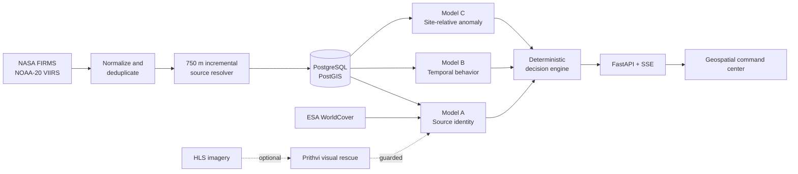

# SIH26162 Prototype Pitch Guide

**Pitch date:** 11 September 2026
**Audience:** SIH judges, mentors, technical reviewers, and operational stakeholders
**Purpose:** Give every teammate one shared, accurate story for explaining and demonstrating the prototype.

> **One-line description:** SIH26162 converts raw satellite hotspots into stable source sites, determines what each source is, understands how it behaves over time, detects unusual activity, and presents prioritized evidence to an analyst.

> **Safety statement:** This is an evidence-first decision-support system. It is not life-safety-grade fire confirmation, and a satellite hotspot is not automatically an industrial fire.

---

## 1. The 30-second pitch

NASA FIRMS detects many thermal hotspots, but a hotspot alone does not tell an operator whether it is an industrial source, whether it has just reactivated, or whether today's activity is unusual for that location. Our platform groups repeated observations into stable physical source sites and evaluates three separate questions: **What is the source? How is it behaving? Is today's activity abnormal for that site?** A deterministic decision engine combines those answers into explainable, deduplicated alerts. Analysts can inspect the map, timeline, raw FIRMS detections, facility evidence, and optional HLS/Prithvi imagery in both live and historical replay modes.

## 2. The two-minute opening script

Use this nearly word-for-word if a short introduction is required:

> Satellite hotspot feeds are excellent at showing where heat was observed, but they are not an operational answer by themselves. The same feed can contain industrial heat, seasonal burning, wildfires, and other persistent or temporary sources.
>
> SIH26162 turns those individual observations into site-level intelligence. First, our source resolver associates detections with stable physical sites instead of treating every hotspot as a separate incident. Then three independent components answer three different questions.
>
> Model A estimates source identity: industrial, nonindustrial, or unknown. Model B is an interpretable temporal engine that identifies new, intermittent, persistent, dormant, and reactivated behavior. Model C compares today's activity only with that site's earlier history to determine whether the event is normal, elevated, anomalous, or critical.
>
> A deterministic decision policy combines these signals. It can prioritize a critical anomaly at a known industrial site, flag a reactivation, or request urgent analyst review when a source is still unknown. Importantly, it does not convert uncertainty into a confident claim merely to make the dashboard look complete.
>
> The result is a live and replay-capable geospatial command center built with FastAPI, PostgreSQL/PostGIS, React, MapLibre, and deck.gl. It gives analysts a traceable path from an alert back to the satellite detections and evidence that produced it.

## 3. The problem we solve

Raw hotspot products leave several operational questions unanswered:

- Are repeated detections observations of one physical source or separate events?
- Is the source industrial, nonindustrial, or not yet identifiable?
- Is it normally persistent, newly active, dormant, or reactivated?
- Is the current thermal activity unusual relative to that same site's history?
- Which observations deserve analyst attention first?
- What evidence supports the conclusion?

The prototype addresses this gap between **hotspot detection** and **explainable operational triage**.

## 4. How the system works



### Source resolver — “Which observations belong together?”

- Training-time sources use the frozen DBSCAN-derived **750 m neighborhood radius** and `min_samples=3`.
- The operational unit is a stable source site, not an individual hotspot row.
- New detections are assigned incrementally instead of rerunning full-year clustering.
- A new unmatched source is promoted only after at least three spatially consistent observations.
- Ambiguous matches are audited; existing sites are not silently merged.

Why 750 m? A 1,000 m alternative slightly improved a weak-label score but caused physically implausible chaining and merged distant micro-sites. The 750 m definition preserved source identity better.

### Model A — “What is this source?”

Model A-Core is a frozen XGBoost pipeline using exactly **33 features**:

| Feature family | What it describes |
| --- | --- |
| Thermal | FRP distribution and nighttime behavior |
| Recurrence | Detection frequency, active days, lifetime, and recurrence gaps |
| Spatial | How tightly detections cluster around the source |
| Land cover | ESA WorldCover composition around the site |

The decision bands are deliberately conservative:

| A-Core probability | Output |
| ---: | --- |
| `< 0.405` | `NONINDUSTRIAL` |
| `0.405 to < 0.885` | `UNKNOWN`, unless strong Prithvi evidence rescues it |
| `0.885 to < 0.975` | `INDUSTRIAL_CORE_POSITIVE` |
| `>= 0.975` | `INDUSTRIAL_CORE_STRONG` |

Optional Prithvi behavior:

- It runs asynchronously only for the uncertain A-Core band.
- It uses a cloud-screened six-band HLS patch and the frozen Prithvi-EO-2.0-300M encoder.
- A Prithvi probability of at least `0.965` may rescue an uncertain site as industrial.
- It can never veto an A-Core result at or above `0.885`.
- If HLS, Earthdata, or Prithvi is unavailable, A-Core still returns normally.

### Model B — “How is the source behaving?”

Model B is a **deterministic temporal-state engine**, not a trained classifier.

| State | Plain-language meaning |
| --- | --- |
| `NEW` | Recently observed source without enough established history |
| `INTERMITTENT` | Activity appears occasionally rather than persistently |
| `PERSISTENT` | Repeated activity over a sufficiently long period |
| `DORMANT` | Previously observed source has been inactive for a long interval |
| `REACTIVATED` | Activity returned after a qualifying dormant gap |

Its state is calculated relative to the live or replay `as_of_date`. This matters because a source can become dormant even when no new detection arrives.

### Model C — “Is today unusual for this particular site?”

Model C is a site-specific, chronological anomaly engine. It evaluates four evidence groups:

| Evidence group | Question |
| --- | --- |
| Intensity | Is FRP unusually high for this site? |
| Density | Are there unexpectedly many detections today? |
| Recurrence burst | Has the site returned sooner than its normal gap? |
| Change | Is there sustained escalation through EWMA/CUSUM behavior? |

Model C uses only **prior completed active days** as the historical baseline. It never uses future observations when scoring a past date.

| Score | Status |
| ---: | --- |
| `< 0.950` | `NORMAL` |
| `0.950 to < 0.990` | `ELEVATED` |
| `0.990 to < 0.999` | `ANOMALOUS` |
| `>= 0.999` | `CRITICAL` |
| Insufficient baseline | `INSUFFICIENT_HISTORY` |

`INSUFFICIENT_HISTORY` does not mean normal. It means the platform does not yet have enough site history for a reliable site-relative comparison.

### Decision engine — “What should the analyst see first?”

The final alert is produced by frozen, deterministic rules rather than an opaque fourth model.

Examples:

- Industrial + critical anomaly → `CRITICAL_INDUSTRIAL_ANOMALY`
- Industrial + reactivated + elevated/anomalous → `INDUSTRIAL_REACTIVATION_ANOMALY`
- Unknown + critical → `UNKNOWN_CRITICAL_REVIEW`
- Nonindustrial activity → low-severity context, not an industrial incident

Alerts use a stable fingerprint made from site, day, alert type, and model-stack version. A same-day escalation updates the incident instead of generating repeated unrelated alerts.

## 5. What makes the prototype different

1. **Site intelligence instead of another hotspot map.** Repeated satellite points become persistent, auditable source identities.
2. **Identity, behavior, and anomaly are kept separate.** A large anomaly does not automatically imply an industrial source.
3. **Uncertainty is preserved.** `UNKNOWN` and `INSUFFICIENT_HISTORY` are valid operational results.
4. **Historical replay is leakage-safe.** Model B uses the replay date and Model C uses only information available at that time.
5. **Alerts are explainable and deduplicated.** Every alert follows a readable rule and retains reason codes and provenance.
6. **The browser is presentation-only.** FIRMS keys, Earthdata credentials, database access, and model execution remain server-side.
7. **The architecture is extensible.** The same ingestion and land-cover pipeline can cover other countries, while country-specific validation and evidence must still be performed responsibly.

## 6. Current prototype facts

Use these numbers with their scope clearly stated:

| Fact | Current value | Correct wording |
| --- | ---: | --- |
| Frozen 2025 source catalogue | 79,365 sites | “The original frozen catalogue contains 79,365 source sites.” |
| Current shared runtime snapshot | 118,779 sites | “The operational database expanded through incremental 2026 processing.” |
| Current shared detections | 1,580,275 | “The shared runtime snapshot contains about 1.58 million FIRMS detections.” |
| Shared snapshot cutoff | 8 September 2026 | “Live startup catches up after the restored snapshot date.” |
| Offline demo bundle | 38 daily snapshots | “Four deterministic scenarios work without external network access.” |
| Model A features | 33 | “The serialized deployed pipeline expects the frozen 33-feature order.” |

These are snapshot facts, not promises that every browser viewport renders all 118,779 sites simultaneously. The map retrieves a compact, viewport-filtered subset for performance; global counts come from server-side statistics.

## 7. Validation claims we can defend

### Model A

The primary internal evidence is a geographically grouped frozen holdout of 4,672 sites, including 169 industrial and 4,503 nonindustrial sites.

| Operating point | Holdout precision | Holdout recall | Specificity |
| --- | ---: | ---: | ---: |
| LOW threshold `0.405` | 0.4894 | 0.9527 | 0.9627 |
| CORE threshold `0.885` | 0.8199 | 0.7811 | 0.9936 |

Say: “Model A was evaluated with geographic grouping to reduce spatial leakage.”

Do not describe the older repeatedly used external benchmark as pristine blind validation.

### Model B

Model B has complete coverage of the frozen 79,365-site 2025 catalogue and reproduces its frozen state distribution. Its validity is interpretability, rule consistency, and temporal construct validity—not supervised classification accuracy.

### Model C

Valid claims:

- chronological and leakage-free scoring;
- stable calibration in later replay;
- monotonic response to controlled increases in thermal/density signals; and
- broad ranking agreement with an independent Isolation Forest audit.

Do **not** report Model C accuracy, precision, recall, or industrial-fire detection rate. Independent event-level anomaly ground truth has not yet been established.

### Prithvi pilot

The guarded pilot used 233 usable sites from a 270-site cohort. At the `0.965` rescue threshold, DEV out-of-fold precision was 0.9524. The guarded holdout made one rescue and it was industrial. Present this as a promising but limited pilot branch, not broad validation.

## 8. Recommended 8-minute demonstration

### Before speaking

Keep the backend and frontend already running. Open these tabs:

1. Command center: `http://localhost:3000`
2. Health: `http://127.0.0.1:8000/api/v1/health`
3. API explorer: `http://127.0.0.1:8000/docs`

Do not begin the pitch by installing packages, rebuilding the database, or waiting for a backfill.

### Minute 0–1: Establish the map and operating mode

- Point to the readiness/mode indicator.
- Say whether the screen is showing `LIVE` or `REPLAY`.
- Explain that replay is intentional when demonstrating a known historical sequence.
- Point out the global counts and the map's viewport-loaded count.

Suggested line:

> “The number at the top describes the operational database; the map loads only the current viewport so it stays interactive at national scale.”

### Minute 1–3: Open one source site

- Select a visible site marker.
- In the overview, explain the A, B, and C cards in that order.
- Read the labels before discussing probabilities.
- Point out the feature cutoff/as-of date so the audience sees temporal provenance.

Suggested line:

> “These are three separate conclusions: identity, temporal state, and site-relative anomaly. No one signal is allowed to silently overwrite the others.”

### Minute 3–4: Show timeline and detections

- Open **Timeline** and show how daily FRP/detection history supports Model B and C.
- Open **Detections** and show the raw FIRMS observations behind the aggregate.

Suggested line:

> “The analyst can move from a high-level alert back to the individual satellite observations that produced it.”

### Minute 4–5: Show evidence and satellite tabs

- Open **Evidence** to show facility or contextual registries separately from model output.
- Open **Satellite** for HLS/Prithvi status.
- If Prithvi is pending, say it is asynchronous and does not delay A-Core.
- If unavailable, explain that the system preserves A-Core and explicitly records the reason.

### Minute 5–7: Demonstrate historical replay

Use the rehearsed industrial reactivation scenario:

| Field | Value |
| --- | --- |
| Scenario | Industrial reactivation after dormancy |
| Site | `INDIA_SITE_0004528` |
| Replay range | 5–21 April 2026 |
| Focal date | 19 April 2026 |
| Map area | Longitude 72.45–73.05, latitude 21.60–22.20 |
| Expected focal result | A=`INDUSTRIAL`, B=`REACTIVATED`, C=`ANOMALOUS` |
| Expected alert | `INDUSTRIAL_REACTIVATION_ANOMALY` / `HIGH` |

- Start before the focal date.
- Advance toward 19 April.
- Explain that Model B recognizes the return after dormancy while Model C measures unusual activity.
- State that the alert follows the deterministic decision policy.

The current interface is map-driven. Rehearse the map location beforehand rather than depending on an unrehearsed site search.

### Minute 7–8: Close with operational value

> “The platform does not replace an analyst. It reduces a large hotspot feed into prioritized, explainable site-level cases and preserves the evidence needed to verify each conclusion.”

## 9. Deterministic fallback scenarios

The repository contains four network-independent, checksummed demonstrations:

| Scenario | Focal date | Expected result | Point to make |
| --- | --- | --- | --- |
| Industrial critical anomaly | 23 Apr 2026 | Industrial + intermittent + critical → critical alert | Separate identity from anomaly severity |
| Industrial reactivation | 19 Apr 2026 | Industrial + reactivated + anomalous → high alert | Temporal behavior adds operational meaning |
| Unknown critical review | 25 Apr 2026 | Unknown + intermittent + critical → high review | Critical activity does not fabricate identity |
| Nonindustrial contrast | 28 Apr 2026 | Nonindustrial + intermittent + critical → low context | Anomaly does not override identity |

Verify and print the exact walkthrough before the pitch:

```powershell
.\.venv\Scripts\python.exe .\backend\scripts\build_demo_cache.py --verify-only
.\.venv\Scripts\python.exe .\backend\scripts\demo_walkthrough.py
```

With the backend running, also verify the API-served bundle:

```powershell
.\.venv\Scripts\python.exe .\backend\scripts\demo_walkthrough.py `
  --base-url http://127.0.0.1:8000/api/v1
```

If the UI path fails, use the **Offline Demo** section in Swagger to retrieve the focal snapshot while continuing the same explanation.

## 10. Demo recovery plan

| Problem | What to do | What to say |
| --- | --- | --- |
| Live mode is blocked | Switch to replay and check `/api/v1/health` after the pitch | “The platform fails closed when the common model snapshot is stale.” |
| Internet or FIRMS is unavailable | Use the 38 cached replay snapshots | “The deterministic replay uses checksummed local evidence.” |
| Earthdata/HLS is slow | Continue with A-Core and cached evidence | “Prithvi is optional and asynchronous by design.” |
| Prithvi says pending | Do not wait silently; continue to Timeline/Evidence | “The 300M image encoder runs outside the immediate A-Core path.” |
| Too few sites appear | Zoom/pan and let the viewport query finish | “The UI intentionally avoids rendering the complete national catalogue at once.” |
| Too many markers appear after zooming | Explain viewport loading and clustering/level of detail | “The total database count and currently drawn marker count are different measures.” |
| Backend is unreachable | Use the verified offline walkthrough output while a teammate restarts it | “The scenario bundle is designed for network-independent judging.” |

## 11. Likely judge questions and concise answers

### “Is this simply a NASA FIRMS map?”

No. FIRMS is the observation source. Our system resolves repeated detections into stable sites, classifies source identity, models temporal behavior, scores site-relative anomalies, and produces explainable operational alerts.

### “Why do you need three models?”

Because they answer different questions. Identity, behavior, and abnormality are not interchangeable. Keeping them separate prevents errors such as calling every large anomaly industrial or treating every persistent industrial heat source as an emergency.

### “Is Model B machine learning?”

No. Model B is a deterministic and interpretable temporal-state engine. We describe it accurately rather than calling every component AI.

### “Does CRITICAL mean a confirmed industrial fire?”

No. It means the current site-day is extreme relative to that site's historical behavior. The final interpretation also depends on source identity and analyst evidence.

### “Why can a site remain UNKNOWN?”

Because available evidence may not support a confident industrial or nonindustrial identity. Preserving `UNKNOWN` is safer than manufacturing certainty.

### “What does INSUFFICIENT_HISTORY mean?”

The site lacks enough completed active-day history for Model C's site-specific baseline. It is not equivalent to normal.

### “Why is Prithvi optional?”

A-Core is fast and structured. The 300M Prithvi encoder requires HLS imagery, cloud screening, Earthdata access, and heavier compute. It therefore runs asynchronously only when A-Core is uncertain and can only add a guarded rescue.

### “How do you prevent data leakage in replay?”

Model B receives the replay date as its cutoff. Model C scores a date using prior completed active days only. The replay API does not substitute the site's current/final state for its historical state.

### “Can this expand beyond India?”

The FIRMS ingestion, WorldCover extraction, HLS retrieval, source-resolution logic, and backend architecture are geographically reusable. Expansion still requires a new regional bounding box, historical backfill, local facility/evidence integration, and country-specific validation of Model A and alert burden. We do not claim automatic zero-validation transfer.

### “How is live operation implemented?”

The backend polls NOAA-20 FIRMS NRT at a configurable interval, normalizes and deduplicates detections, assigns them incrementally to sites, refreshes affected A/B/C state, updates the PostGIS snapshot, and publishes alert changes through Server-Sent Events.

### “Why NOAA-20 and not every satellite?”

NOAA-20 is the frozen A-Core feature stream. Mixing NOAA-21 without a sensor-harmonization audit could change feature distributions. NOAA-21 support is a controlled future improvement rather than an unverified production shortcut.

### “How do teammates get the same database?”

They restore the shared, checksummed PostgreSQL dump. The repository bootstrap path is reproducible but slower because it rebuilds and backfills the operational database.

### “What happens when the same alert appears repeatedly?”

Alerts have stable fingerprints. Repeated evidence for the same site-day and alert type is deduplicated, while a genuine severity increase becomes an escalation.

### “Where are credentials stored?”

FIRMS, Earthdata, and database credentials are backend environment variables. They are never sent to browser code or committed to Git.

## 12. Claims to avoid

Do not say any of the following:

- “This confirms industrial fires.”
- “Model C has 99.9% accuracy.” The `0.999` value is a calibrated severity threshold, not accuracy.
- “Every anomaly is a fire.”
- “UNKNOWN means nonindustrial.”
- “INSUFFICIENT_HISTORY means normal.”
- “Model B is a trained ML model.”
- “Prithvi overrides A-Core.”
- “FIRMS type values provide industrial ground truth.”
- “All 118,779 sites are rendered in the browser at once.”
- “The model works in every country without new validation.”
- “The platform is life-safety certified.”

Prefer these phrases:

- “decision support”
- “thermal source” or “satellite hotspot observation”
- “site-relative anomaly”
- “industrial-classified source”
- “analyst review required”
- “geographically grouped internal holdout”
- “near-real-time polling”
- “explainable deterministic alert policy”

## 13. Suggested team speaking roles

For a four-person team:

| Role | Responsibility | Target time |
| --- | --- | ---: |
| Speaker 1 — Problem and value | Problem statement, users, one-line solution | 1.5 min |
| Speaker 2 — Intelligence stack | Source resolver and Models A/B/C | 2.5 min |
| Speaker 3 — Product demo | Map, site drawer, timeline, evidence, replay | 4 min |
| Speaker 4 — Validation and scale | Claims, architecture, deployment, roadmap, closing | 2 min |

Everyone should know the distinction between Models A, B, and C. One teammate should remain responsible for monitoring the backend terminal and switching to the offline scenario if necessary.

## 14. Night-before checklist

### Application readiness

```powershell
# Backend tests
.\.venv\Scripts\python.exe -m pytest .\backend\tests -q

# Artifact/database readiness
.\.venv\Scripts\python.exe .\backend\scripts\verify_bootstrap_artifacts.py

# Offline demo integrity
.\.venv\Scripts\python.exe .\backend\scripts\build_demo_cache.py --verify-only
```

### Start the prototype

Backend terminal:

```powershell
.\.venv\Scripts\Activate.ps1
python -m uvicorn backend.app.main:app --host 127.0.0.1 --port 8000
```

Frontend terminal:

```powershell
Set-Location .\frontend
npm run dev
```

### Verify the running services

```powershell
Invoke-RestMethod http://127.0.0.1:8000/api/v1/health
Invoke-RestMethod http://127.0.0.1:8000/api/v1/stats
Invoke-RestMethod http://127.0.0.1:8000/api/v1/live/status
Invoke-RestMethod http://127.0.0.1:8000/api/v1/demo/status
```

Confirm before leaving the system untouched:

- health and readiness response understood;
- database and PostGIS reachable;
- frontend opens without console errors;
- selected replay scenario rehearsed from start to finish;
- offline demo reports 38 verified snapshots;
- laptop power and presentation display tested;
- `.env` secrets are not visible in any open editor or terminal history;
- browser zoom is readable from the back of the room;
- one screenshot or screen recording is available as the final fallback.

## 15. Final 20-second close

> SIH26162 transforms a high-volume satellite hotspot feed into explainable source-level intelligence. It separates what a source is, how it behaves, and whether today's activity is unusual; then it gives analysts a prioritized alert with the evidence needed to investigate. The architecture is already live/replay capable, auditable, and designed to expand carefully as regional validation and additional sensors become available.

---

## Quick glossary

| Term | Meaning |
| --- | --- |
| FIRMS | NASA Fire Information for Resource Management System |
| VIIRS | Satellite instrument supplying thermal observations |
| FRP | Fire Radiative Power; a satellite-derived thermal intensity measure |
| HLS | Harmonized Landsat and Sentinel-2 surface-reflectance imagery |
| Prithvi | IBM/NASA geospatial foundation-model encoder used as optional visual evidence |
| PostGIS | Geospatial extension used by the PostgreSQL runtime database |
| SSE | Server-Sent Events used to push alert changes to the browser |
| Replay | Historical view evaluated at a past temporal cutoff |
| A-Core | Primary structured-feature source-identity model |
